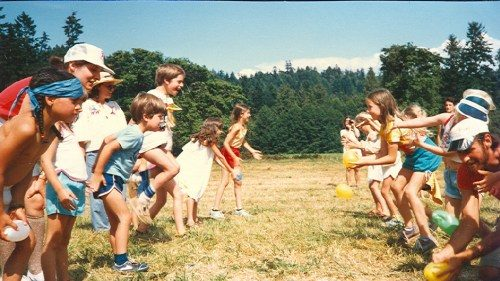
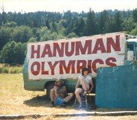

**The Hanuman Olympics** was a revered tradition since the earliest days of the [Annual Family Yoga Retreat](https://saltspringcentre.com/retreats-programs/family-retreat/) at the Centre. Aptly named after the monkey hero of the Ramayana who is an embodiment of selfless service and strength, the Hanuman Olympics are a sports day with a yogic twist and is all about grown ups and kids having fun together under the summer sun.

The tradition faded away a few years back as the original participants became busier running the Centre (not to mention older). But now, under the leadership of Piet Suess and his crew of enthusiastic karma yogis (of Capture the Flag fame) – Hanuman Olympics is back!
Continuing in the spirit of the original, it will feature all the old favourites: races for different ages, obstacle course, the famous sack fights and Tug of Peace – and more.
*Start training now and come play!* 
**What’s your favourite Annual Family Yoga Retreat memory? Share yours in the comments below!**
