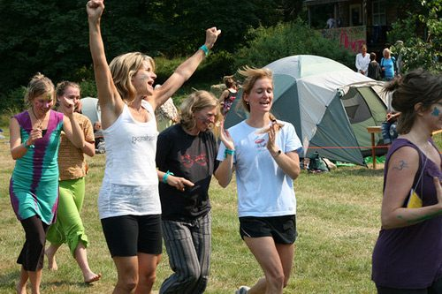
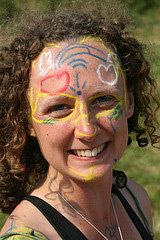

This year we celebrated our **[36th Annual Family Yoga Retreat](../events_annual.htm)**. As well as the usual program of wonderful offerings, there were two very special events that are worth special mention.
First was the Saturday night concert with Bansuri flute master, [**G.S. Sachdev**](http://www.bansuri.net/sachdev/index.html). This was a transporting experience whether you were seated inside the concert space or just outside on a hay bale under the stars.
The second was the 2010 **Hanuman Olympics**. Piet and his crew did a fantastic job of reviving the original spirit of the event not to mention actually setting up and running all of the games. The event really brought everyone together in the spirit of play – the retreat participants, staff and greater Dharma Sara and Salt Spring Island community alike. It was a multi-generational event with a heart-warming, fun-filled atmosphere and lots of laughter and excitement!
On behalf of SSCY, I would like to say a BIG thank you to everyone who participated in making the 36th Annual Family Retreat a wonderful and memorable event, helping to weave together and maintain the fabric of our extended Dharma Sara community. See you there next year!
*Jai Sita Ram! Jai Hanuman!
Om,*
Lakshmi
—
**[Enjoy more photos from the event!](http://www.flickr.com/photos/saltspringcentreofyoga/sets/72157624791487190/with/4930246329/)**
Thanks to Ramesh and Lauren for all the beautiful photos.
