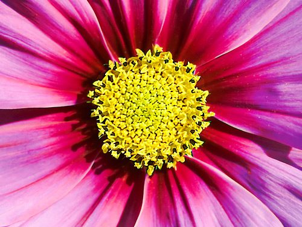

This exercise is a continuation of [Making a Personal Mandala](https://saltspringcentre.com/2010/11/make-your-own-mandala/). As explained there, a mandala is a symmetrical design that uses shape and colour to express an idea. Mandalas are usually abstract, sometimes geometric, and often, but not necessarily, circular. Your personal mandala represents the layers of your self, from the innermost self outward to the face you show the world, with all the protective layers in between.

### What you need:

- Drawing paper
- Materials for colouring. Colour is important in a mandala; oil pastels are great because they have strong, vibrant colour. Felt pens are also good.

### How To Make A Relationship Mandala

1. In this exercise you make two mandalas on the same page. The first is your [personal mandala](https://saltspringcentre.com/2010/11/make-your-own-mandala/). The second is for the other person. Let the mandalas come from inside, where you intuitively know about this relationship. Don't try to control them.
2. When you're done, have a look at the page. What does it have to tell you? Colour, size, placement on the page, kind of lines (soft or sharp edges) - all these things can tell you something about the relationship. Is one mandala big and the other small? Is one crowding into the other's space? There is no right or wrong way to interpret your drawing - you may have reasons for your interpretation or simply a feeling about what it means. Let yourself be intuitive as you look at the mandalas and how they interact on the page.

Photo by: [Antediluvial](http://www.flickr.com/photos/distill/)
