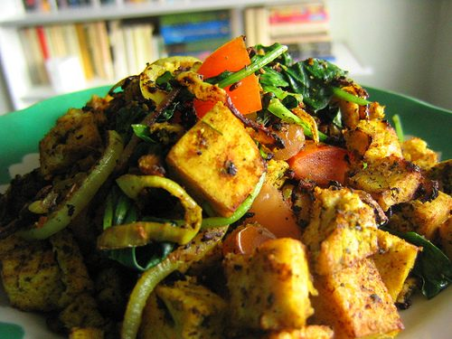

A spicy alternative to eggs, great with buttered rye or sourdough rye toast or rolled in a tortilla. Sid, our local jalapeno aficionado, swears this recipe came down from the ancient Aztecs, revealed to him in a vision.
INGREDIENTS:
SERVES 6-8
2 Tbsp (30 mL) olive oil
1 cup (240 mL) chopped leeks or onions
2 cups (480 mL) chopped green peppers
6 cups (1.54 L) crumbled or cubed tofu
2 cups (480 mL) chopped tomatoes
5 Tbsp (75 mL) tamari
4 Tbsp (60 mL) balsamic vinegar
1 Tbsp (15 mL) turmeric
1 Tbsp (15 mL) turbinado sugar
2 finely minced pickled jalapeno peppers (adjust to taste)
1/4 cup (60 mL) pitted and chopped Greek olives (optional)
METHOD:
In a wok or large frying pan, saute the leeks and green peppers in olive oil over medium-high heat.
Add the rest of the ingredients, stirring regularly until the tomatoes are cooked in.
ENJOY!
(Recipe reproduced from *The Salt Spring Experience: Recipes for Body, Mind and Spirit*. If you would like to purchase a copy of our popular book, [email us](mailto:yoga@saltspringcentre.com) and we'd be happy to send you one.)
Photo by: [rusvaplauke](http://www.flickr.com/photos/rusvaplauke/)
