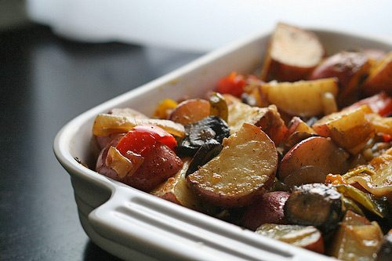

[](images/7badbc20_roasted-roots2.jpg)
An easy, warming meal that prepares itself while you finish writing the Great Canadian Novel. Use any combination you like of your favourite root vegetables.
**INGREDIENTS:**

- Serves 4-6 as a main or side dish.
- 2 cups (480mL) coarsely chopped leeks
- 2-2 1/2 cups (480-600mL) chopped potatoes
- 2-2 1/2 cups (480-600mL) chopped yams
- 2 cups (480mL) chopped carrots
- 1 Tbsp (15mL) oregano
- 1 Tbsp (15mL) basil
- 1 Tbsp (15mL) parsley
- 1 tsp (5mL) rosemary
- 1/2-1 tsp (2-5 mL) salt
- 1/2 tsp (2mL) pepper

**METHOD:**

1. In a bowl, sprinkle the spices over the vegetables and mix in.
2. Spread out the chopped vegetables in an oiled baking pan or on a cookie sheet.
3. Cover the pan and bake at 400°F (205°C) for 45 minutes.
4. Uncover the pan and bake for 15 minutes more or until the vegetables are soft and beginning to brown.

**Recipe from *The Salt Spring Experience*.**
Photo by: [redcargurl](http://www.flickr.com/photos/erinkohlenbergphoto/)
