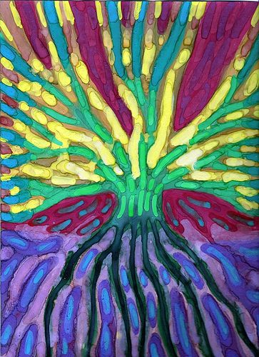

Identifying what you want to bring into your life - both tangible and intangible things - can be the first step toward making it happen. A Wish Tree can help you clarify and then stay focused on your goals.

### What you need:

- Paper or poster board for the collage
- Magazines suitable to your goals
- Scissors, glue, drawing and colouring materials

### How to do it:

1. Draw a tree. It doesn't have to be great art. A child's drawing of a trunk and branches is just right.
2. Look through magazines to find pictures of things that you want to bring into your life. It can be tangible things, like a new car, education, or travelling to visit friends and family. Or the pictures can be symbolic of intangible things, like love, friendship, or courage.
3. Glue all the things you want to bring into your life on the branches of your tree. Add any other colouring or decorations that you like.
4. Hang your Wish Tree in a place where you'll see it and be reminded of your goals.

Image by: [Wojtek Kowalski](http://www.flickr.com/photos/37308944@N04/)
This Activity is from *The Salt Spring Experience*.
