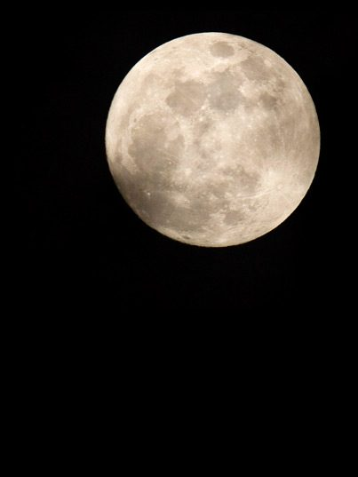

**A Yajna (pronounced Yag-ya) is a ritual of sacrifice** derived from the practice of Vedic times. It is performed to please the deities or to attain certain wishes. An essential element is the sacrificial fire - the divine Agni - into which oblations are poured, as everything that is offered into the fire is believed to reach the deities.
Join us at the Centre for our monthly Yajna celebrations, which always happen before the full moon, and start at 7:30pm.
**Visit our [online calendar](https://saltspringcentre.com/calendar/) to find out when the next celebration will take place.**
