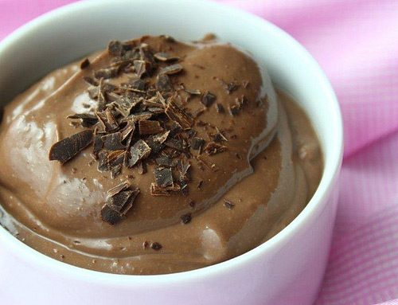

Absolutely delicious! You must use the best Belgian chocolate to ensure complete success.
INGREDIENTS:
Serves 8-10

- 4 1/2 cups (1.08 L) silken tofu (3 boxes)
- 2/3 cup (160 mL) Belgian chocolate chunks
- 1 tsp (5 mL) vanilla extract

METHOD:

1. Melt the chocolate in a double boiler.
2. Blend the melted chocolate, tofu, and vanilla in a food processor.
3. Serve at room temperature or chilled.
4. Enjoy!

**Recipe from *The Salt Spring Experience*.**
Photo by: [llsimon53](http://www.flickr.com/photos/37341119@N02/)
