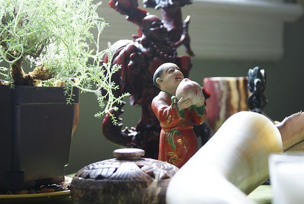

Your personal altar is an expression of your inner self, and so each one is as unique as the person who makes it. An altar may be religious, or it may be the altar of your heart -- what's important is that you are creating your personal sacred space. Your altar might be on a table, a shelf or a windowsill; its purpose is to give you a quiet place to be with yourself. Use it for prayer and meditation, inspirational reading, reflection and journal writing -- or just sit quietly, pause, and let the demands of daily life fall away.
**How to Make Your Altar**

1. Select a place that can be just yours, with room enough for a small table and a cushion or a chair to sit on. If you don't have a private spot choose the corner of a room or even a corner of your desk. Collect images and objects that are meaningful to you or that inspire you, and arrange them on your altar in a way that pleases you.
2. Ideally the things on your altar will help you to leave behind the stresses of daily life and connect with your inner self in a peaceful way. You might choose photos of inspiring people as well as items that have spiritual significance for you or precious things that people have given you.
3. In planning your altar, think about how you'll use it as well as why you want to have on it. Your altar is a reflection of your life and of your inner self -- it is complete when you're happy with the way it looks or how it makes you feel.

> One friend has things of nature on her altar because, for her, a feeling of unity comes from being in nature. She has shells, stones, leaves and branches on her altar as well as spiritual readings and other things that are meaningful and inspiring to her.
> Another friend has her altar at ground level. Her young grandchildren are involved, bringing things that are special to them. This altar is always alive and changing, as some things are removed and others added. The same friend has a small, stuffed Piglet on her altar because Piglet is playful, loving and devoted -- qualities she admires and likes to encourage in herself. Her altar is a joyful place, she says. It cheers her up.

**Activity from *The Salt Spring Experience*.**
Photo by: [Avia Venefica](http://www.flickr.com/photos/avenefica/)
