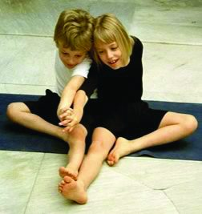
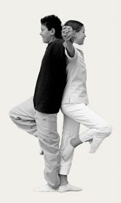

## Why Yoga in the School?

Being a successful teacher requires great energy, inner strength, resourcefulness and creativity. As with any classroom instruction, it is important for the teacher to provide the model. If teachers have inner strength and harmony, children will feel it and imbibe it. Through sharing the simple techniques presented in this book, teachers may inspire students to enhance both physical and mental strength and develop habits that will enable them to take responsibility for their own well-being for the rest of their lives.

### The Benefits of Yoga in Your School

Our modern world is highly advanced in technology, yet we have lost many of the ancient keys to the knowledge of the art of living. Recently, Yoga has become increasingly popular worldwide and an estimated 35 million people in North America now take a Yoga class once a week.
Yoga is currently practiced in many educational institutions worldwide. In several countries in Europe and South America, Yoga has been taught in schools for more than twenty-five years. Many schools in North America have already trained teachers to include Yoga as a regular part of the class­room day. It is also becoming more common as a regular part of the physical educa­tion curriculum where it offers a non-competitive alternative to competitive sports.
In addition to enhancing physical and mental well-being, Yoga teaches students to concentrate, releases tension and develops inner qualities such as patience and insight. With regular practice, students learn to devel­op better self-control, inner confidence and focus. Regular Yoga practice unifies the two sides of the brain, allowing information and knowledge to enter the brain at deeper levels. Practicing the exercises together enhances the relationship between teacher and students, enabling them to work together productively and enjoy the learning process.
Integrate Yoga Breaks into Your Daily Schedule

## Take a Yoga Break

Yoga in Your School presents a series of short Yoga breaks, simple breathing and movement exercises that teachers may easily insert into their daily classroom sched­ule.  Each exercise takes less than three minutes, so that teachers may present them regularly or as needed, when attention or energy begins to wane. These short exer­cise segments may also be combined creatively to create longer sequences for phys­ical education classes, playgrounds, athletics, recreation centers, camps, and dance schools. Taking a few minutes to breathe and stretch between activities will allow students to better assimilate knowledge learned, create a more harmonious class­room and inspire a more joyful, effective learning process.

### Yoga Break Benefits

- Develop motor skills and balance
- Create physical and mental strength and flexibility
- Energize body and mind and bring more oxygen to the blood cells and brain
- Make breath, blood and lymph fluids circulate better
- Release physical and mental tensions that have accumulated while students who have been sitting for a long time
- Enhance concentration
- Develop better listening skills
- Improve posture
- Bring students into the present moment
- Exercise the body and balance the emotions
- Open the shoulders and chest, allowing students to relax and breathe deeper during their classes
- Open the hip joints and prepare students to sit comfortably
- Teach patience and insight
- Create a calm harmonious classroom

## Bring Yoga to your School

Join us for a five day training workshop (March 21-25, 2011) led by *Yoga In Your School* author Teressa Asencia and learn how to integrate yoga into a daily classroom schedule and take your personal yoga practice to a new level of playfulness. This workshop is designed to help teachers integrate simple movement and breathing exercises into their daily classroom schedule to fulfill their daily DPA (daily physical activity).
Learn more about this training workshop at [saltspringcentre.com/retreats-programs/yoga-in-your-school](https://saltspringcentre.com/retreats-programs/yoga-in-your-school/)
