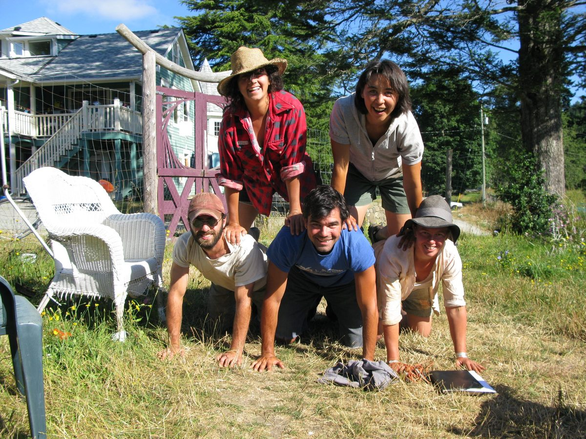

Karma yoga at the Centre has been a beautiful and transformative experience for many, providing time away from the busy-ness of daily life to connect with one's self, with nature and with like-minded people.
The following are a few more reasons, as compiled from Karma yogis of the past.

### Reasons to practice Karma yoga at the Salt Spring Centre

- Amazing abundance of harvest from our organic farm
- The beautiful weather
- The cool swims at the nearby lakes
- The colourful flowers
- Asanas in the sun
- Supportive and friendly people
- Healthy space - break from negativity
- In harmony with nature
- Freedom from the mundane
- The spirit of the place
- The community of wonderful and inspiring people
- The extraordinary opportunities for learning and growth through the practice of yoga
- The amazingly delicious food
- The great beauty of the land
- Definitely the people. Whether serving the guests or sharing time with fellow KYs it's a blessing to be together
- The focus. Self-less service and meditation give joy and peace to the experience
- Re-union. Every returning KY is a friend from before
- Community. By working, playing and practicing together our family grows every season
- Fulfillment. The completeness of the experience removes desire
- The intention of the Centre
- The people carrying out the intention
- The morning meditations
- Having access to yoga classes
- Being in Divine nature

**Enjoy more photos of Karma yoga life [here](http://www.flickr.com/photos/saltspringcentreofyoga/sets/72157622132025718/).**
