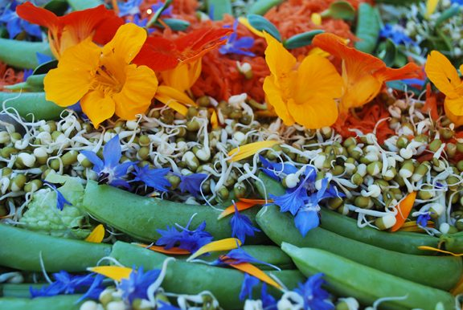

A big bowl of freshly harvested salad greens is a staple on the buffet table at the Centre, sometimes ornately decorated with glorious flower petals, beet and carrot mandalas, other times with a simple side of fresh, homemade sprouts. You can, however, always count on a big jug of delicious salad dressing to drizzle over your leaves, petals or seeds. Miso ginger dressing is a popular one.
**Ingredients:**

- 1/4 cup chopped leeks
- 1 cup olive oil
- 1/2 cup balsamic vinegar
- 1 rounded Tbsp fresh grated ginger
- 4 rounded Tbsp miso
- 1 tsp honey
- 1 rounded Tbsp tahini
- 1 cup water

**Method:**
In a blender, combine until smooth. Drizzle and enjoy!
