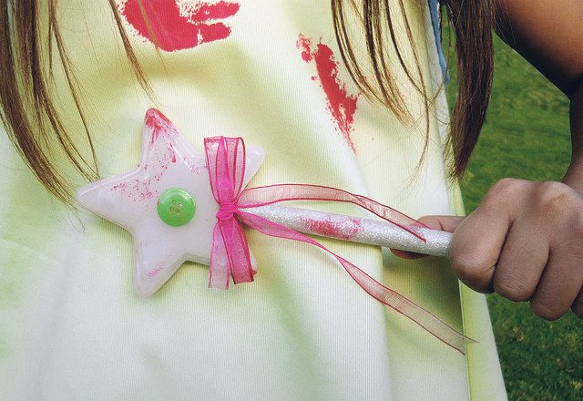

Making a magic wand is a playful reminder that you can create your own magic with the power of positive thought and action. When it's done, hang it on the wall or put if where you'll see it often; let it remind you that we always have a choice about our attitudes and the way we look a the world around us. This activity is fun to do with children, who have no trouble believing in magic.
**What You'll Need:**

- A stick, and things to decorate it with. You can look outside for things of nature, like a branch, feathers or leaves. You might go to the local hobby shop to buy a plastic stick and colourful decorations like streamers and glitter. Anything goes.
- A hot glue gun and coloured string or ribbon to attach things to the stick.
- Acrylic paints and brushes if you plan to paint your stick.

**How to Make It:**

1. If you want to paint your stick, do that first.
2. Now glue and tie the decorations onto your magic wand.
3. If you feel uncertain how to go about it, find a girl under the age of eight and ask her to make one with you. She'll show you what to do!
4. When you're done, play with it, dance with it, and then put it where you'll see it often. Bring it down any time you want to make magic.

**Activity from *The Salt Spring Experience*.**
Photo by [Caro.H](http://www.flickr.com/photos/aleca_99/)
