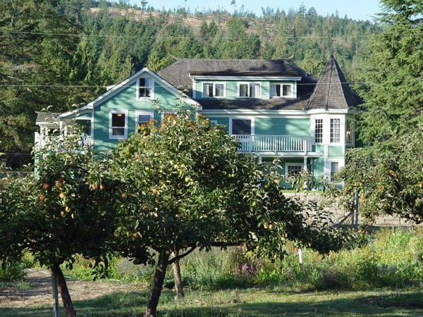

**Greetings:**
The year 2011 marks the thirtieth anniversary of our purchase of the Centre land. It also marks the centenary of the building of the main house, and this prompts questions about its origin and history. This beautiful, heritage building was constructed by the Blackburn family from Scotland who gave their name to the road, the valley and the lake. The original Blackburn family home in Scotland, a huge ten bedroom, castle-like mansion called Roshven, still stands with its commanding view of the quaintly named islands of Eigg, Muck and Rhum. The Salt Spring house, though a much more modest structure, echoes some features of that original family home, notably the turret on the northeast corner. Roshven has also been renovated to accommodate overnight guests, just as we have done at the Centre. In this hundredth anniversary year we are planning an open house to celebrate all those from the Blackburns in 1911 to the karma yogis of 2011, who have contributed to the maintenance and upkeep of this fine building and its lands.
The realities of renovating very old buildings can, however, be daunting, with their many incarnations of electrical wiring and plumbing. Despite this, our new dishroom will be ready in a few weeks and we are planning kitchen upgrades for later this year. Our major outdoor project this year is decommissioning the campground outhouses in favour of new composting ones. Also, at this year's [annual family retreat](https://saltspringcentre.com/retreats-programs/family-retreat/), there will be a revival of the rock crew who worked each summer under Babaji's skilled eye to construct our many rock walls. Some of these walls are now in need of repair and Ram Sharan from [Mount Madonna](http://www.mountmadonna.org/) will be here to lead this project.
The program season is now well under way. This week we host our second [Yoga Getaway](https://saltspringcentre.com/retreats-programs/yogagetaways/) of the year, followed by the [Prenatal Yoga Teacher Training](https://saltspringcentre.com/retreats-programs/prenatal-yoga-teacher-training/). In May we have the [Ayurveda Lifestyle workshop](https://saltspringcentre.com/retreats-programs/ayurveda-lifestyle-workshop/), May 20-22nd. Last year we promoted [personal retreats](https://saltspringcentre.com/retreats-programs/personal-retreats/) as a way to join the Centre community but without the structured days of a workshop. These proved very popular with people appreciating the ability to set their own daily schedule around community classes and meals. We are enhancing this experience with our new *Asana Teacher in Residence* program, in which we invite a suitably qualified and experienced asana teacher to spend a week at the Centre in return for teaching daily classes. Please [contact us](mailto:yoga@saltspringcentre.com) if you or someone you know might be interested in this possibility.
In peace,
Shankar
