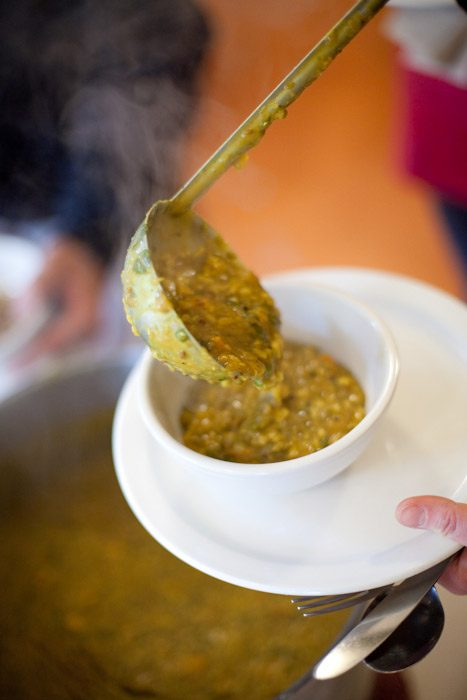

Kitcharee is a favourite dish of guests and Karma Yogis alike. It's a combination of mung beans, rice and spices that warms and nourishes. It is also easy to prepare and just plain delicious.
**Ingredients:**
SERVES 8-10

- 6 Tbsp ghee
- 1/2 tsp black mustard seeds
- 1 Tbsp turmeric
- 2 tsp coriander
- 3 Tbsp cumin
- 1/2-1 tsp chili flakes
- 1-2 tsp salt
- 1 cup chopped leeks
- 1 cup split mung beans (uncooked)
- 2 cup basmati rice (uncooked)
- 8 cups water
- 5 Tbsp ginger juice

**Method:**

1. Heat the ghee in a soup pot. When it's hot, add the mustard seeds. When they pop, add the other spices (except ginger) and the leeks.
2. Stir the spices for a minute or two. Watch that they don't burn.
3. Add the rice and mung beans. Stir to coat them with the spices. Then add the water and bring to a boil. Cover the pot and turn the heat down to simmer until the rice and mung beans are cooked (about half an hour).
4. Add the ginger juice.

**Variations:**

- You can add more water if you prefer your kitcheree soupier, and more ghee if you want it richer.
- You can add vegetables like potatoes or squash to the pot for a heartier version.
- You can add chopped fresh kale or chard near the end of the cooking time for some extra green goodness.
- How do you like your kitcheree? Do you have a different version of this recipe? Do share in the comments!

Recipe reproduced from *The Salt Spring Experience: Recipes for Body, Mind and Spirit*.
If you would like to purchase a copy of our popular book, [contact us](mailto:yoga@saltspringcentre.com) and we'd be happy to send you one.
Photo by [www.grantharder.com](http://www.grantharder.com)
