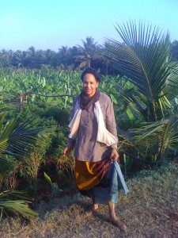

[caption id="attachment\_2541" align="alignright" width="225" caption="Girija in South India"][/caption]
Ayurveda is the science of life and longevity. The word “Ayurveda” comes from a combination of two Sanskrit words: “ayus” (life) and “veda” (knowledge of). This May, long time Ayurveda practitioner and teacher, Girija Edwards, will lead workshop participants in an engaging and empowering exploration of the principles of Ayurveda.
Here Girija shares a bit about her practice and how it has impacted her life, as well as an Ayurvedic tip that can be easily integrated into your life.
**Q: How long have you been practicing the principles of Ayurveda?**
Without actually knowing it, I've been practicing Ayurveda since 1968, 43 years ago. At that time, I became a vegetarian and understood it was best to eat local and simple foods. In 1980, Baba Hari Dass introduced me to a health system known as Ayurveda. That same year I had my first formal lesson in Ayurveda from [Dr. Robert Svoboda](http://www.drsvoboda.com/index.html).
At that juncture I had been involved with the natural health food and natural healing movements, here on the west coast. So as I listened to Dr. Svoboda expounding the genuine holistic healing approaches of Ayurveda, my whole being vibrated with its Truth. Now, what I had witnessed at healing clinics and ashrams, the numerous diets I had experimented with, herbal remedies I prescribed, could all easily be explained from the principles put forth in Ayurveda. There was no need to search any other system of natural healing. The practice is here and will be for years to come.
**Q: How have the principles of Ayurveda impacted your life?**
Understanding Ayurvedic principles has had a most profound impact in my life. Not a day goes by since 'knowing' that I do not look, hear, smell, taste or touch, without observing what Ayurvedic principles are at play. As the basic theory proposes that we are a product of five elements: ether, air, fire, water and earth. Different combinations of these five elements are what determines who we are both physically and mentally.
In my recent experience living at an authentic Ayurvedic clinic in South India, I was able to see far beyond my expectations about what Ayurvedic therapies can do both physically and mentally for those with serious health problems and those such as myself just wanting to experience the traditional and authentic Ayurveda at its source. The Vaidyas (Ayurvedic physicians) at the clinic used these ancient Ayurvedic principles wisely, thus having an impact that has further changed me both physically and mentally. Just when you think you understand, a beautiful thing happens that transports you to another level of being.
**Q: Can you share one easy tip/practice/recipe that is easy to incorporate into daily life?** 
Your tongue is a barometer of your digestive activity. Clean the tongue using a tongue scraper, spoon or blunt side of a dinner fork. Once you have finished with the tongue scraping, drink warm water - not coffee or tea - just warm water. Tongue scraping removes ama, or toxic waste, from the surface of the tongue, as well as stimulating digestive function.
Find out more about Girija's experience of Ayurveda on her blog [OilOfOhm.com](http://oilofohm.com/).
**To learn more about how the practice of Ayurveda can bring wellness into your life and to learn more practical tips, join us for an [Ayurveda Lifestyle Weekend](https://saltspringcentre.com/retreats-programs/ayurveda-lifestyle-workshop/), led by Girija Edwards and Christine O’Donnell, May 20-22, 2011.** 
**Take advantage of our Bring-A-Friend discount. [Details online.](https://saltspringcentre.com/retreats-programs/ayurveda-lifestyle-workshop/ayurveda-workshop-fees/)**
