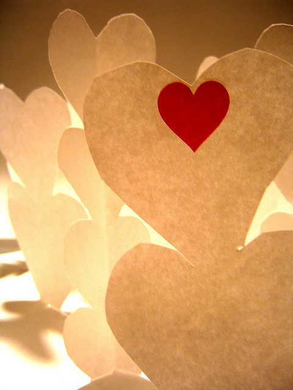

To be recognized for the positive qualities we display in our lives is supportive and validating. To be honoured this way at a special occasion makes us feel especially appreciated. The Virtues Acknowledgement is a card given on an occasion like a birthday, Valentine's Day, Father's Day...or Mother's Day.

### What you need:

- Poster board or drawing paper, 8.5" x 11" or larger
- A photo of the person being honoured
- Felt pens
- Glue

### How to do it:

1. At the top of your card, glue a photo of the person to be honoured and put his or her name beside it.
2. Below the picture make a separate place for each person to write an acknowledgment. Choose from the ideas below or make up your own.
3. Have everyone write on the card ahead of time so that it will be ready for the special occasion. People can choose to sign their acknowledgments or be anonymous.

### Making it Special

For a birthday card, draw balloons—one for each person who will sign the card. Put strings on the balloon and tie them together at the bottom of the page with a ribbon. For Valentine's Day, those balloons can become hearts and you can fill each one with qualities you love about the special person. For Mother's Day, those hearts can become flowers...Which ever shape you choose, ensure they are big enough for you or someone else to write an acknowledgment in.
This act of reflecting on a person's good qualities has positive benefits for the person doing the acknowledging as well.
--
Activity taken from the *Salt Spring Experience: Recipes for body, mind and spirit*.
Find other soul-nourishing activities [here](https://saltspringcentre.com/category/activities/).
Photo by [Ctd 2005](http://www.flickr.com/photos/kikisdad/).
