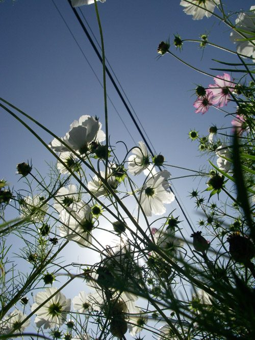

**Greetings:**
Spring is the time of renewal, a time to clean the dark corners left untouched through the winter. As more and more spring flowers begin to bloom, albeit belatedly this year, the Centre too is being beautified. Hanging flower baskets are being prepared and scores of flower varieties are waiting in trays in the greenhouse for the farmland to be ready, the tilling delayed by the unusually cool weather. Inside the main house there are changes some less obvious, like the new dishroom, but some like the pictures of Babaji demonstrating various asanas are in full view. Spring is also a time of awakening and, lest visitors think that yoga is all about asanas, the wall in the foyer has a picture of Babaji along with a large plaque that quotes him: *"Dream is real so long as you are not awake; life is real until you wake up."*
In just this sense the word buddha also refers to awakening, and on May 16th we host [Wesak](https://saltspringcentre.com/2011/04/join-us-for-wesak/), a celebration of the birth, enlightenment and passing of the Buddha, literally the awakened one. This was a joyous and popular event last year, and again the Centre brings together representatives of the island's different Buddhist communities: Zen, Tibetan and Vipassana for an evening of prayer, chanting and meditation. We hope you will join us.
Another upcoming event is Dharma Sara's [Annual General Meeting](https://saltspringcentre.com/2011/05/notice-of-2011-agm/), taking place on Sunday June 26th from 10am-12pm, when there will be an update on DS activities in the past year, an overview of DS finances (happily in good shape) and elections to the board.
We are delighted to see the [Yoga Teacher Training](https://saltspringcentre.com/yoga-teacher-training/) program filling rapidly; if you or anyone you know is considering taking this course, it would be good to act soon as there are not too many places left. The [Ayurveda Lifestyle weekend](https://saltspringcentre.com/retreats-programs/ayurveda-lifestyle-workshop/), May 20th - 22nd still has openings, though the May Yoga Getaway is full. It is gratifying to see the high percentage of newcomers to our [Yoga Getaways](https://saltspringcentre.com/retreats-programs/yogagetaways/), reflecting both the effectiveness of our upgraded website and the glowing personal referrals from past attendees.
Thanks are due to our 2011 karma yogis who have stepped into their tasks with skill and enthusiasm and have demonstrated so well the ideal of selfless service that Babaji exemplifies. A recent guest said that she had never seen such a happy group of young people. Now we look forward to the large new group coming in at the beginning of June, as the program season gains momentum.
Finally, we received a lovely write-up by a visitor from *Monday Magazine* who joined us for a [Personal Retreat](../retreats-programs/personal-retreats/). [Read the article here.](http://mondaymag.com/articles/entry/salt-spring-centre-is-a-tranquil-oasis/) 
In peace
Shankar
