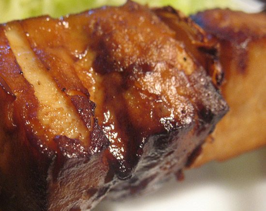

This recipe is so easy and delicious. Try serving it over a steaming bowl of brown rice with a side of crisp, stir fried bok choi or gai lan. Try it tonight!
SERVES 8-10
**Ingredients:**

- 2 lb tofu
- 2 Tbsp olive oli
- 1/3 cup tamari or Bragg's

**Sauce**:

- 1 1/2-2 Tbsp grated ginger
- 1/2 cup and 2 Tbsp turbinado sugar
- 1 cup cider vinegar
- 2 Tbsp tamari
- 6 oz tomato paste
- 2 Tbsp arrowroot powder mixed in 1/4 cup cold water

**Method:**

1. Cut the tofu into 1/4 inch slices or 1/2 inch chunks.
2. Brown the tofu in a frying pan with the olive oil and tamari or Bragg's.
3. Place all the sauce ingredients in a saucepan and bring to a boil, then simmer until the sugar dissolves and the sauce begins to thicken.
4. Place the tofu in a baking pan and cover it with the sauce.
5. Bake at 350° for 45 minutes.

Enjoy!
Recipe reproduced from *The Salt Spring Experience: Recipes for Body, Mind and Spirit*.
If you would like to purchase a copy of our popular book, [contact us](mailto:yoga@saltspringcentre.com) and we’d be happy to send you one.
Photo by: [Stiefen Schlingen](http://www.flickr.com/photos/48819629@N02/)
