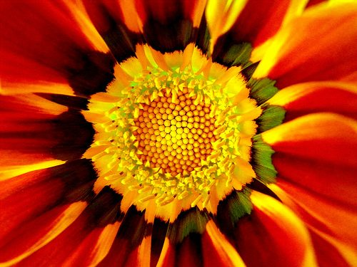

****

A mandala is a symmetrical design that uses shape and colour to express an idea. Mandalas are usually abstract, sometimes geometric, and often, but not necessarily, circular. Your personal mandala represents the layers of your self, from the innermost self outward to the face you show the world, with all the protective layers in between.
**What you need:**

- Drawing paper
- Materials for colouring. Colour is important in a mandala; oil pastels are great because they have strong, vibrant colour. Felt pens are also good.

### How to Make a Personal Mandala

1. Sit or lie comfortably with your eyes closed as you let the demands of daily life fall away. Allow yourself to relax. Let go of the outer world and turn you attention inward.
2. Now imagine your innermost self, the part of you that is most hidden from the world. what do you notice about this inner you? Stay with your sense of self, noticing anything that comes up, until you feel ready to begin drawing.
3. Begin your mandala in the centre of the page, using colour and shape symbolically to represent yoru innermost self. The size of this representation is up to you, and will probably be different for ever person. Choose colours and shapes that feel right to you. You don’t have to know why you are choosing them. and remember, this is not about making art.
4. Gradually move outward from the centre of the page, allowing your colour and shapes to represent each protective layer of your inner self. When you reach the outside edges of your mandala, depict the face that you show to the world.
5. When you look at your finished mandala, you’ll see yourself from a new perspective. This is who you are in colour. What do you learn about yourself form the colours and shapes you’ve chosen?

Next month, we’ll explore relationship mandalas…
–
Photo by: [MAMJODH](http://www.flickr.com/photos/mamjodh/with/3551605462/)
