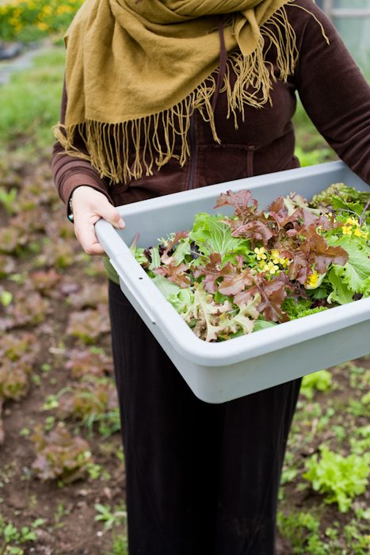

Although the weather hasn’t really caught on to the idea of summer, it is indeed almost officially summer and life is in its expansive form here at the Centre.
Early next week we will be welcoming sixteen more karma yogis into our growing community. The farm yogis (or “Soil Sisters”, as they call themselves) have been working hard planting for the past few weeks, and delicious tender greens from the garden are being served at meals. Our new landscaping yogi has been working non-stop, cleaning up all the flower-beds and trying to stay ahead of the endless lawn mowing. The builders have been busy as well: the dish room has been completed, the laundry room has been completely redone, the yurt is being renovated and the fourth kutir is just about done. It’s amazing what can happen when a dedicated group of karma yogis works together in a spirit of joyful service.
We continue to get rave reviews from our [personal retreat guests](https://saltspringcentre.com/retreats-programs/personal-retreats/) and program participants about the peaceful environment, the caring community and, of course, the food, thanks to our wonderful kitchen team. [Yoga Getaways](https://saltspringcentre.com/retreats-programs/yogagetaways/) continue to fill, and [Yoga Teacher Training](https://saltspringcentre.com/yoga-teacher-training/) has only a few spaces left. Our [37th Annual Community Yoga Retreat](https://saltspringcentre.com/retreats-programs/family-retreat/) (known for a few years as the Annual Family Retreat, and for many years before that as simply The Retreat), begins July 28 and is now accepting registrations.
A reminder: [Dharma Sara Satang Society](https://saltspringcentre.com/about/dharma-sara-satsang/) is the registered charity that owns and operates the Salt Spring Centre of Yoga. The society's [annual general meeting](https://saltspringcentre.com/2011/05/notice-of-2011-agm/) is coming up on Sunday, June 26th, from 10 am – 12 pm. Anyone who is interested in becoming involved is welcome to attend and learn more about the functioning of the Centre and other DS endeavours.
Photo by [Grant Harder](http://grantharder.com).
