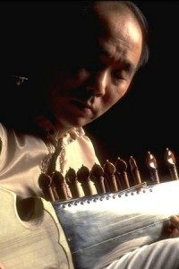

[Steve Oda](http://www.myspace.com/steveoda) is an exceptional virtuoso on the sarode - a North Indian Classical instrument. Steve has been a disciple of the great Indian maestro Ustad Ali Akbar Khan since 1973. He has dedicated himself to fully learning the classical music of India and to carry on the teachings of his illustrious guru. In 1996, he received a prestigious Canada Council Artist's Grant to pursue intensive studies at an advanced level with Ali Akbar Khan. He moved to the San Francisco Bay area in 1998 and served for two years as Executive Director of the Ali Akbar College of Music in San Rafael, California.
For over 30 years Steve has been blessed with many international performances and the demand for his playing continues to increase throughout North America as well as in Spain, France, Holland, Sweden, Australia, New Zealand and Japan. He will be accompanied by Victoria’s outstanding resident tabla player NIEL GOLDEN. This evening promises to be a journey to the heart of music, with ancient rhythms, exotic melodies, and mysterious shifting textures of sounds opening into the present moment.
WHAT: Indian Classical Concert, Steve Oda (on sarode) & Niel Golden (on tabla)
WHEN: 7:30pm, Thursday, June 23, 2011
WHERE: Salt Spring Centre of Yoga, 355 Blackburn Road, Salt Spring Island, BC
COST: $15 at the door
[www.steveoda.com](http://www.steveoda.com)
[www.nielgolden.com](http://www.nielgolden.com)
