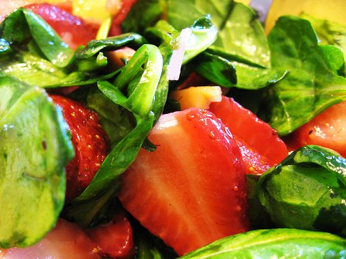

Imagine a big bowl of fresh picked salad greens sprinkled with asiago cheese, nuts, and dressing, glistening in the late afternoon sun. Very refreshing on a hot day. Try garnishing with fresh red raspberries or sliced strawberries.
SERVES 6
**Ingredients
Dressing:**

- **1/4 cup olive oil**
- 1/8 cup balsamic vinegar
- 1/8 - 1/4 cup maple syrup
- 1/4 tsp salt
- 1/4 tsp pepper

**Salad:**

- 8 cups salad greens or spinach
- 1/2 cup pine nuts or walnuts
- 1-2 Tbsp butter or ghee
- 3/4 cup grated asiago cheese or fresh grated parmesan
- Sliced strawberries or fresh raspberries(optional)

**Method**

1. Mix the dressing in a jar and set aside
2. Wash the salad leaves or spinach, tear it into bite-size pieces, and pour the dressing over it.
3. Chop the pine nuts or walnuts and sauté them in butter or ghee, then sprinkle them over the greens.
4. Sprinkle the cheese on the salad and toss.
5. Garnish with sliced strawberries or fresh raspberries in season.

Enjoy!
Recipe reproduced from *The Salt Spring Experience: Recipes for Body, Mind and Spirit*.
If you would like to purchase a copy of our popular book, [contact us](mailto:yoga@saltspringcentre.com) and we’d be happy to send you one.
Photo by [Plat](http://www.flickr.com/photos/21993940@N00/).
