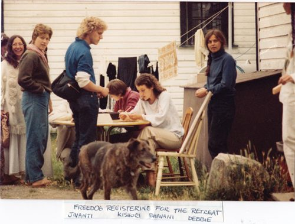

**Our first yoga retreat was way back in 1975.** Babaji had told us when he visited in 1974, "If you have a retreat, I will come." What more incentive did we need? None of us had run a retreat before, but we learned by doing. The first retreat was at a camp we rented in White Rock, outside of Vancouver. It lasted 10 days and rained for 9 of them. We had a few teachers and a lot of naïve enthusiasm. I can’t remember how many people came, but it was probably around 200. We had a great, if wet, time - and we learned a lot!
We held the next few retreats at a children's camp in Oyama in the interior of BC. Before the retreat, we'd gather for what we called pre-retreat, which was both a special time for us to be with Babaji and a time to pack vehicles with materials we'd need for the retreat.
The camp wasn't available to us till 1:00 pm, and we'd open the doors for registration at 4:00. In those 3 hours we'd scour the camp from top to bottom and set everything up. There was no such thing as pre-registration in those days. People just showed up; those who wanted to help were assigned jobs. Between 300 – 400 people came.

Yoga classes were held wherever there was space, including the tennis court and a large tent. There were no yoga mats (yoga mats didn't exist yet) so folks did asanas on blankets or foamies while Babaji and Anand Dass demonstrated postures on a table.
During the day there were all the same classes we have now - shat karma, pranayama, meditation, yoga theory. We also had our famous canoe races - the beginnings of the future [Hanuman Olympics](https://saltspringcentre.com/2010/06/hanuman-is-back/).
At meal times everyone sang kirtan while waiting for the food line in the dining room to move. Babaji sat with the children at a table in the middle of the room and entertained them by flipping paper plates with a fork while the adults waited for their food. This did not exactly calm the kids down, but they had a great time – and the parents couldn't say anything because it was Babaji causing the excitement.
Kirtan in the evenings was very lively, with lots of people dancing at the back of the large hall. We had other evening entertainments as well, with many a hilarious skit that was created and "rehearsed" during the retreat.

After a few years Babaji directed us to buy land. The story of the search for and purchase of the land is another story, but we finally did buy the land on Salt Spring in 1981. We held our retreat that year at a camp on the Sunshine Coast. The first retreat at the Centre was in the summer of 1982. Despite running out of water that summer, it was a fabulous retreat in our new home.
Back then there were no computers, and people signed up upon arrival. Over time we became more efficient, but some things haven’t changed. Retreats still offer excellent classes, a program for children, amazing organic food, and a chance to get together to study and play. Some people return every year and new people continue to join us.
A whole generation has grown up with the experience of the annual yoga retreat. Now some of those people, along with other young people, are taking on responsibilities in all the areas of the retreat.
Babaji came to our retreats every year for many years. We have many fond memories of sitting with him under the maple tree and working on projects like rock walls, all of which were built during summer retreats. Now he's 88 and doesn't travel any more, but his teachings are embedded in the very air we breathe at the Centre.

This year is our 37th annual retreat. The name has changed a few times, the original name being "the yoga retreat", then for a few years "the Annual Family Retreat", and now, to better reflect the fullness of our community, "[the Annual Community Yoga Retreat](https://saltspringcentre.com/retreats-programs/family-retreat/)".
This year we are also celebrating the Centre's 30th anniversary and the 100th anniversary of the program house built by the Blackburn family from Scotland all those years ago. We're anticipating another wonderful retreat and we look forward to seeing you here.
Om,
Sharada
[Enjoy some photos of last year's retreat.](http://www.flickr.com/photos/saltspringcentreofyoga/sets/72157624791487190/)
[Find out more about this year's retreat](https://saltspringcentre.com/retreats-programs/family-retreat/), which runs from **July 28th – August 1st, 2011**.
