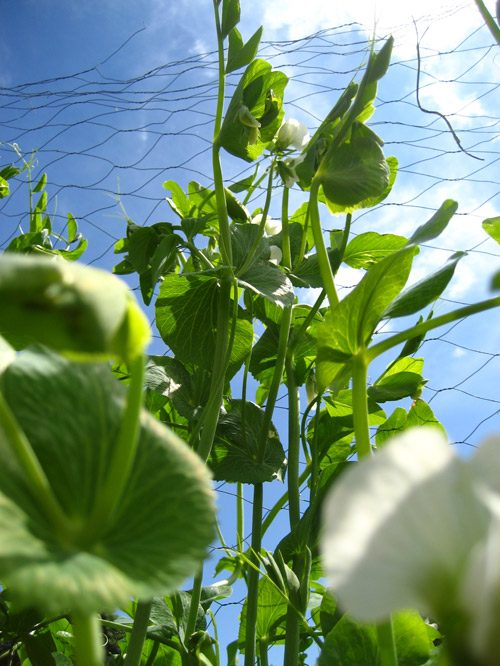
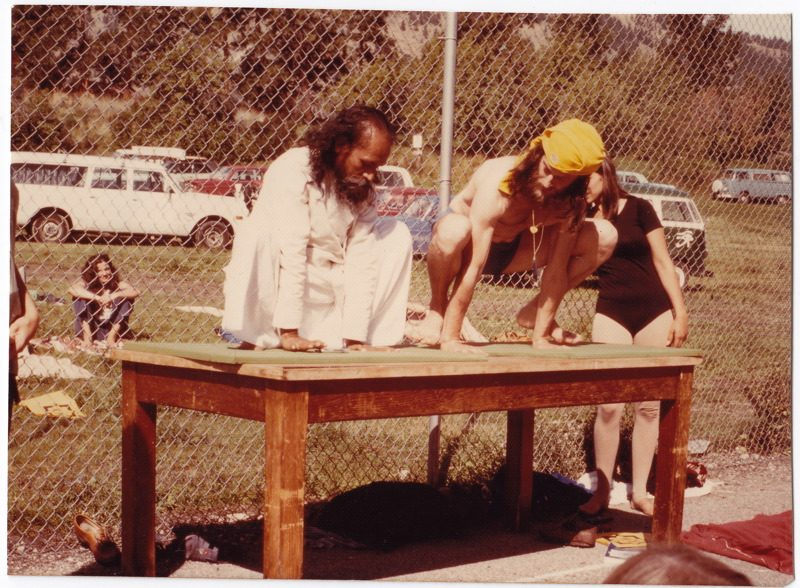

The peas are head high, the strawberries are ripening and the first meal of new potatoes can't be far off. The swallows' nest just outside the kitchen door has been home to scores of swallows over the years, and has entertained countless staff and guests, and more than a few wide-eyed children. Now the latest batch of fledglings are ready to take their first step into the hitherto unknown world of flying. Meanwhile inside the main house, 39 new students, from as far away as Thailand and England, are taking their first steps in our [Yoga Teacher Training](https://saltspringcentre.com/yoga-teacher-training/) program, now in its tenth year. Based on our experience over the years, this will be a life-changing program for most of them. Many find out about us by word of mouth from our graduates in the community at large. An increasing number cite our new website as the way they were attracted to the Centre. This may also explain why more first-time guests are coming to our [Yoga Getaways](https://saltspringcentre.com/retreats-programs/yogagetaways/).
Last Sunday the Centre hosted Dharma Sara's Annual General Meeting featuring an excellent series of reports from the different operational areas. Progress at the Centre has been steady throughout 2010 and the first half of 2011 and this newsletter has given updates on all our building and renovation projects. Less obvious are the major changes in work scheduling and this has made the scheduler's task far less stressful. The KYSS program has also been streamlined with fewer sessions, fewer KYs and session-long schedules, again simplifying the administrative load. With improved efficiencies in all areas we will be better prepared to take on some of the larger building projects the Board is considering, such as new KY and guest housing and a new hall/asana space larger than the satsang room.

At the Centre on Thursday July 14th, starting at 8am, we celebrate [Guru Purnima](https://saltspringcentre.com/2011/06/guru-purnima-full-moon-yajna/), the special occasion each year when we honour Babaji and all spiritual teachers. Two weeks later on Thursday July 28 is the start of our annual retreat now renamed the [Annual Community Yoga Retreat](https://saltspringcentre.com/retreats-programs/family-retreat/). On a summer day in 1974 Bababji said to a small group of us: "If you have a retreat, I will come." [Enjoy reading some of Sharada's memories from those first memorable  retreats in this article.](https://saltspringcentre.com/2011/07/37-years-of-yoga-retreats/) For 33 consecutive years Babaji attended, so in 2008 when Babaji stopped traveling it was hard to contemplate a retreat without him. This is now our fourth retreat since then and this annual event is still a wonderful community event. Last year with the return of the [Hanuman Olympics](https://saltspringcentre.com/2010/06/hanuman-is-back/) and the concert by Sachdev, the bansuri master, the retreat was exceptional, as you can see clearly from [these photos](http://www.flickr.com/photos/saltspringcentreofyoga/sets/72157624791487190/). Come to the Centre July 28th and join us for this 37th joyful gathering of our extended community.
In peace,
Shankar
