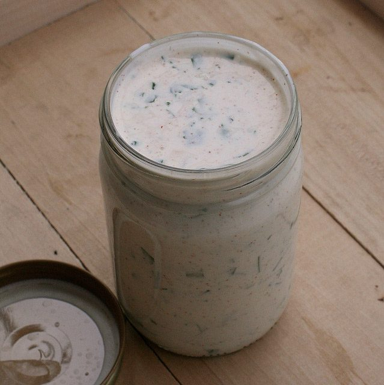

Perfect for dressing the salad greens springing forth from your garden or purchased on the weekend from your local farmer's market, this creamy dressing features fresh herbs like parsley or dill.
**Ingredients:**
(Makes 3.5 cups)

- 2 cups yogurt (use low fat yogurt for a calorie conscious option)
- 1 cup olive oil
- 1/4 cup balsamic vinegar
- 1/3 cup chopped leeks
- 1 Tbsp tamari
- 1/2 tsp salt
- 1/2 tsp pepper
- 2-3 rounded Tbsp honey
- 1 cup fresh herbs like parsley or dill weed

**Method:**
In a blender, combine all ingredients until smooth. Enjoy!
Recipe reproduced from *The Salt Spring Experience: Recipes for Body, Mind and Spirit*.
If you would like to purchase a copy of our popular book, [contact us](mailto:yoga@saltspringcentre.com) and we’d be happy to send you one.
--
Photo by [Whitney in Chicago](http://www.flickr.com/photos/whitneyinchicago/).
