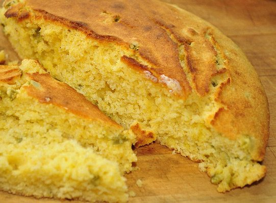

The addition of jalapeno peppers and cheddar cheese means that this cornbread is bursting with flavour.
**Ingredients**

- 1/2 cup cornmeal
- 1/2 cup polenta (corn grits)
- 1/2 cup flour
- 2 Tbsp baking powder
- 1/2 tsp salt
- 1 cup finely minced leeks
- 1/2 tsp chili flakes
- 2 chopped fresh jalapenos, or 4-oz tin chopped green chilies
- 1 cup grated cheese (cheddar or soy)
- 2 tsp blackstrap molasses
- 1 1/2 tsp egg replacer mix with 1 Tbsp of water
- 1 cup milk or soy milk

**Method**

1. Mix dry ingredients together in a large mixing bowl then add the rest of the ingredients.
2. Transfer the batter into a greased 8" x 8" baking pan
3. Bake at 375° for 40 minutes or until the top is brown and crisp.

Slather with butter while fresh from the oven and enjoy!

(Recipe from *The Salt Spring Experience: Recipes for Body, Mind and Spirit*. If you would like to purchase a copy of our popular book, [contact us](mailto:yoga@saltspringcentre.com) and we’ll be happy to send you one!)

--

Photo by: [jeffreyw](http://www.flickr.com/photos/jeffreyww/)
