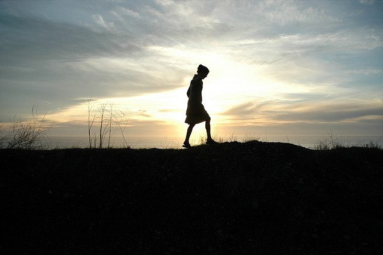

Walking moves the body and deepens the breath; we become relaxed and open to new thoughts and ways of being. Coupled with firm intent, this can provide a wonderful opportunity for inner change. Do this walk when you have a problem, especially if your mind has been turning it over and over with no solution. It can help you shift out of habitual ways of thinking in order to find the answer.

### How to Do It

1. Plan a distance you're comfortable with; your walk may be around the block or it may be a mile or more.
2. Before you set out, know what you're asking for. You might, for example, have a problem with your boss and want to know how to talk to him or her about it.
3. Be ready to let the problem go and to receive a solution. Be committed to action on the answer.
4. Begin your walk. You may walk slowly or quickly. Hold a picture of the situation in your mind, but acknowledge that you don't know the answer and let go of active problem solving. The idea is to get your busy mind out of the way so that your creative mind can discover new ways of looking at things. Notice how good it feels to let the problem go. Stay open and let your thoughts come and go; allow them to shift and change and don't hold onto them.
5. Sometime during your walk you may notice a thought that speaks to you a little differently from the others. It may be a sudden, strong new thought. Often it will be a seemingly insignificant thought that keeps coming back until you begin to pay attention to it. If it seems to demand your attention, then pay attention. Keep walking, and ask yourself if this might be the answer or the beginning of an answer to your question.

Discover other [activities for fun and self-discovery](saltspringcentre.com/category/activities/) from our popular book, *The Salt Spring Experience*.
Photo by: [StarMama](http://www.flickr.com/photos/thestarmama/)
