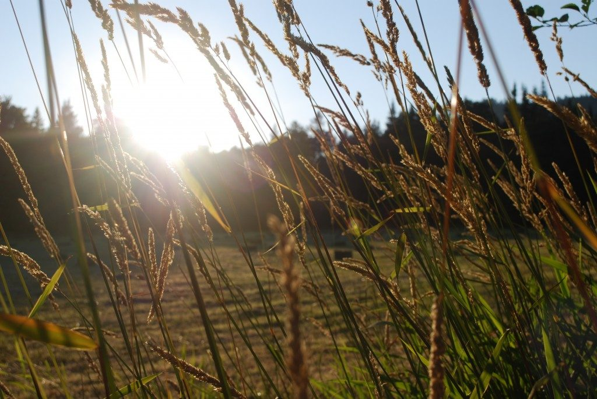

**Greetings:**
Our [37th Annual Community Retreat](https://saltspringcentre.com/retreats-programs/family-retreat/) has come and gone and the gods of weather blessed us. The sun shone, not a drop of rain fell and the hay was baled just in time to provide bleachers and an obstacle course for the [Hanuman Olympics](https://saltspringcentre.com/2010/06/hanuman-is-back/). The Latte Da talent show was indeed a fine display of talent with the very young performers touching the hearts of everyone, and the adults showing an amazing variety of skills from songs, rap, poetry and improvisational comedy to a beautiful song and poem in Persian from a Parsi couple attending the retreat for the first time with their two children. We haven't yet returned to the large numbers that came when Babaji used to attend the retreat but we served dinner to about 175 people on Sunday night. All in all a great success, with many thanks due to all those who helped organise the event, particularly Lakshmi for an unstinting commitment in her role as retreat coordinator.
With a few days rest and reorganization, the Centre prepares to welcome back the [YTT](https://saltspringcentre.com/yoga-teacher-training/) students for their second session. In just one month's time, our [Open House](https://saltspringcentre.com/2011/08/100th-30th-anniversary-open-house/) on Sunday, September 4th will celebrate the centenary of our program house - the original Blackburn residence, and also thirty years of owning the land. We will be inviting the island community to visit the Centre and experience for themselves the beautiful and productive farmland, the lovingly restored heritage house and the vibrant working yoga community that lives on the 69 acre valley land. There will be tours, historical slide shows, classes, and tea in the orchard. The following weekend we host a workshop with [Leonard Jacobson](https://saltspringcentre.com/retreats-programs/other-programs/), whose mission, like other western non-dualist teachers such as Eckhart Tolle and Adyashanti, is to awaken people to the joyous experience of living in the present.
Our [personal retreats](https://saltspringcentre.com/retreats-programs/personal-retreats/) continue to increase in popularity with recent guests from as far away as Toronto, Chicago and San Francisco finding out about us on the internet. It's an excellent option for those who like the delicious meals and the quiet of a retreat with a selection of [yoga classes](https://saltspringcentre.com/yoga-class-schedule/) but without the full day schedule of a regular program. Available dates are shown on our website [calendar](https://saltspringcentre.com/calendar/).
In peace,
Shankar
--
Photo by Lauren Riley
