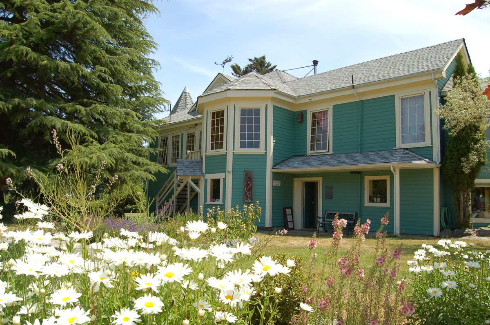

Greetings:
Though the skies are blue and the air warm, camping days at the Centre are over for the year. The summer karma yogis have left for school, travel, work or family and the new group is settling in for the fall, and now we are down to a resident community of less than twenty. It is always interesting to watch a new group of KYs merge into the Centre. At first a little uncertain, within a day or two they are surprised at how much openess and support they receive, and how quickly they feel at home. Some come with a natural understanding of selfless service and this greatly enhances their Centre experience. Others may at first have a delineation between work hours and time off, but usually come round to the understanding that at the Centre we do what needs to be done. Cups left behind, shoes carelessly strewn in doorways, dishes piling up in the bus trays - these are all opportunities for service.  Asking the question "How can I be of help?' is one small way to bring the practice of karma yoga into our daily life. They discover that, as Babaji tells us, the spirit of karma yoga is a mental attitude that we are trying to cultivate not just as we do our work exchange but in all of our life. They learn that karma yoga is far from the simple definition of unpaid work, and may indeed include paid work. By overridiing our self-interest with concern for others we reduce our self-centredness and over time this practice develops the positive qualities of compassion, cheerful optimism, patience and integrity. In this way karma yoga is a wonderful complement to the formal practices of asana, pranayama and meditation.

The immediate task facing the new karma yogis is hosting the island community at our **[Open House](https://saltspringcentre.com/2011/08/100th-30th-anniversary-open-house/) on Sunday September 4th**. We'd like to have Salt Spring islanders know more about who we are and what we do, and have many events planned including a tour and a talk on the century of history of the Blackburn house, free classes, a video on the orphanage, and tea and treats among the apple trees. All are invited.
Our [programs continue through November](https://saltspringcentre.com/calendar/), but we are also looking ahead to 2012. While our regular programs such as the [Yoga Getaways](https://saltspringcentre.com/retreats-programs/yogagetaways/) and [Yoga Teacher Training](https://saltspringcentre.com/yoga-teacher-training/) will be in place, there are many decisions to be made on possible new offerings, staffing, and the size and duration of the [Karma Yoga Service and Study](https://saltspringcentre.com/karma-yoga-service/) program. What projects might we take on and what will the small winter community look like? Some staff have already committed for next year and we will soon be opening registration for next year's KYs. In the meantime we will tidy up, arrange vases of flowers and ready ourselves for Sunday's visitors.
In peace,
Shankar
