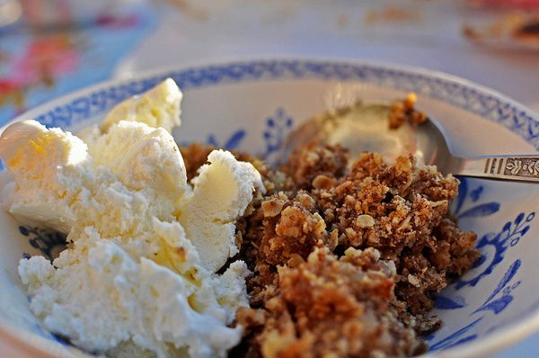

Although myth has it that Eve tempted Adam with an apple, women's wisdom shows it was actually a scoop of apple crumble (with vanilla ice cream). With apples now officially in season, there isn't a better time to make this fall favourite.
**Ingredients**
(serves 12)
Crumble:

- 1 1/2 cups butter
- 1 1/2 cups turbinado sugar
- 2 cups whole wheat pastry, spelt or rice flour
- 4 cups oats
- 1 Tbsp cinnamon

Filling:

- 12 cups thinly sliced apples (about 12 medium)
- 1/2 cup turbinado sugar
- 1 1/2 Tbsp cinnamon
- 1/4 cup butter

**Method**

1. To make the crumble, cream the butter and sugar. Add the flour, oats, and cinnamon and mix together
2. Pat two-thirds of the mixture into the bottom of a 9"x11" baking pan
3. In a mixing bowl, mix the sliced apples, sugar, cinnamon and butter
4. Place it on top of the bottom crust in the baking pan
5. Spread the remaining crumble mixture over the top and pat it down
6. Bake at 350 degrees for 55 minutes to 1 hour.

Serve warm with a scoop of ice cream and enjoy the season's bounty.
**Variation**
A berry crumble is a delicious alternative. Try blueberries, raspberries, black berries — your choice. You'll need a thickner to hold the berries together, so add 2 table spoons of arrowroot powder mixed in 1/2 cup water to the filling.
(Recipe from *The Salt Spring Experience: Recipes for Body, Mind and Spirit*. If you would like to purchase a copy of our popular book, [contact us](mailto:yoga@saltspringcentre.com) and we’ll be happy to send you one!)
–
Photo by [AnneCN](http://www.flickr.com/photos/anne-cathrine_nyberg/)
