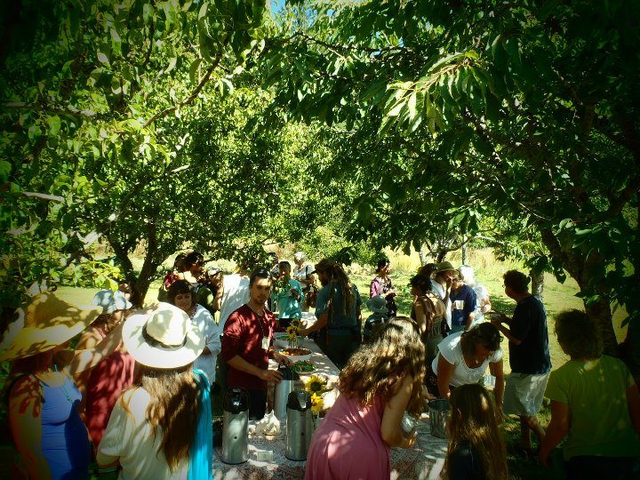

[caption id="attachment\_3582" align="alignnone" width="576" caption="Under the apple trees. Open House 2011"][/caption]
September at the Centre has been delightful with warm sunny days and little rain. Likewise, the [Open House](https://www.facebook.com/#%21/media/set/?set=a.10150288348107800.351612.94876812799) at the very beginning of the month was blessed with a particularly beautiful day which encouraged a couple of hundred islanders to visit the Centre. They were given free yoga classes, tours of the historic Blackburn home in its centenary year and, after a tour of the farm, they were presented with a tempting array of fruits and treats. It was a most festive occasion, so thanks to all who made it possible and to Indica and Alessandra for planning and execution.
This was to be the last of many events that Indica has helped organise over her three seasons here, as she now moves on to other things. She has taken on many roles at the Centre and has been at the heart of the complex task of coordinating the karma yogi program. She also had a season in scheduling, another in marketing and more recently has helped in facility rentals. Her energy and enthusiasm, her ability to prevent issues falling through the cracks and her commitment to the teachings have been greatly appreciated. We wish her well in her future endeavours.
Our [Yoga Teacher in Residence](https://saltspringcentre.com/opportunities-for-yoga-teachers/) program is off to a flying start - applications began coming in as soon as we posted the advertisement. It's a great situation for both the teacher and the Centre. The teacher gets to stay at the Centre with no charge, teach two classes a day and also give private classes. Some, like our current Yoga Teacher in Residence may bring their own students with them so the Centre gets more personal retreatants and greater variety of classes for our staff. We anticipate that this program will fill quickly for next year. Meanwhile we still have plenty of [personal retreat](https://saltspringcentre.com/retreats-programs/personal-retreats/) space in the next two months along with two [Yoga getaways.](https://saltspringcentre.com/retreats-programs/yogagetaways/)
Coming up this Saturday (Oct. 8th) is our annual Thanksgiving pot-luck at the Centre with a gratitude circle. We have chosen the Saturday so you can celebrate with your family on Monday. All are welcome to join us in celebrating the many things we have to be thankful for.
In Peace,
Shankar
