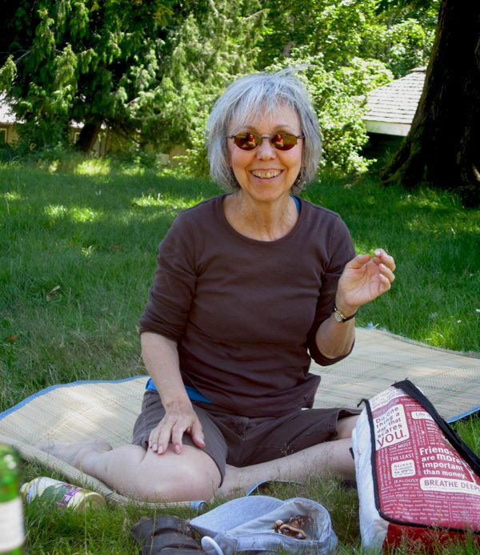
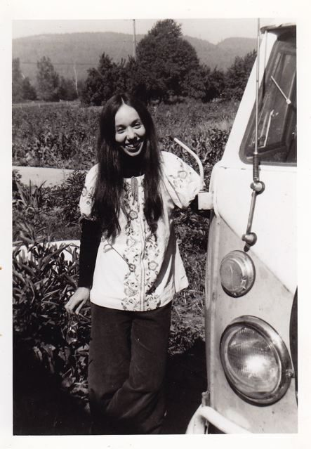
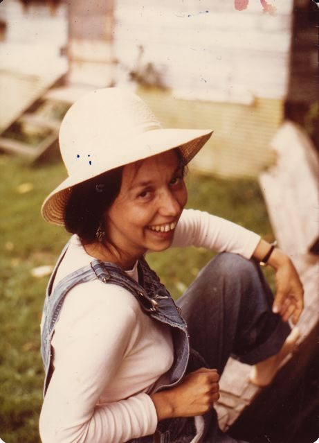

To illuminate part of the Centre’s past, we are beginning a series that profiles some of our longtime members. Each month will feature someone whose contribution to [Dharma Sara](https://saltspringcentre.com/about/dharma-sara-satsang/) has gone on for many decades, and who better to start with than **Sharada Filkow** who has lived at the Centre for close to twenty nine years and continues to give her time and guidance to succeeding generations of karma yogis.
[caption id="attachment\_3765" align="alignnone" width="600" caption="Founding member, Sharada"][/caption]

## Life before Babaji

Prior to meeting Babaji I didn’t particularly consider myself a spiritual seeker, although upon reflection I can see how an unconscious spiritual search was already underway. In my early years in Winnipeg art filled my life and brought me a sense of aliveness and purpose. When my partner Sid and I moved to Vancouver, my world expanded (this was 1967, at the height of the flower power revolution). Rabbi Zalman Schachter-Shalomi, Rabbi Shlomo Carlebach, and later, through our friends AD and Ravi Dass, Ram Dass showed me a whole new way of experiencing the world.

## First meeting with Babaji

[caption id="attachment\_3780" align="alignleft" width="310" caption="Sharada and the 1967 VW van, 1975"][/caption]
Sid and I first met Babaji in 1971; I didn’t realize Babaji had been in North America just a few months at the time. We had driven our 1967 VW camper from Vancouver to Los Angeles to visit Sid’s cousins and do the requisite Disneyland visit with Daya, who was not yet a year old. Ravi Dass, who lived next door to us on Laburnum Street in Kitsilano, had told us Babaji was in Davis, California, and urged us to see if we could meet him. On the way back from our LA adventures, after debating for a while at the side of the road, we called Ma Renu, the woman who had sponsored Babaji to come to North America. She, gracious as ever, told us we were welcome to come right over. We got to spend the afternoon with Babaji, sitting on his bed with him while he played with Daya and answered Sid’s questions. I understood that this was special although I had very little understanding of its true significance. I realized later that I had never met anyone who didn’t want anything from me, that Babaji was simply present, fully available, with no judgements. His eyes and his smile radiated love and complete acceptance. I felt this, but didn’t really get it until later.
So that was it. We had met Babaji and were touched by his presence, but then we went back to Vancouver and life continued to unfold. In 1973, Babaji came to Vancouver with Ma Renu and gave darshan at our house. It was wonderful, and although several people came, no group gathered to become a satsang.

## Dharma Sara begins to form

Later that year, we went to Israel on a 5 month adventure. While we were there we received a letter from Ravi Dass, saying, “Why are you there? You should be here.” Babaji was again in Vancouver and this time a group of students had gathered around him - the beginning of the satsang. We got back at the beginning of 1975 and, totally jet lagged, went to satsang at the Spruce Street house. I thought it was very strange - images of an elephant-headed god and strange rituals. I can’t say I resonated with it right away, but I did like the people. I was first drawn to Babaji and then to community. Babaji and community still keep me here.

## The first yoga retreats

[caption id="attachment\_2987" align="alignnone" width="576" caption="Babaji and AD (Anand Dass) demonstrating asanas on a table in the tennis court at the 1977 yoga retreat in Oyama."][/caption]
Lots of things happened after that. A few of us rented a farm in Abbotsford, east of Vancouver, and people began to come there on Sundays for satsang. Babaji had said that if we held a yoga retreat, he would come, so in the summer of 1975, we rented a camp in White Rock and held our [first retreat](https://saltspringcentre.com/2011/07/37-years-of-yoga-retreats/), none of us ever having done anything like it before. AD was a gifted teacher and an extremely kind - and funny - person who did his best to demystify the teachings of yoga. However I didn’t spend much time in classes. I started out in childcare and remained there for 30 years. (I finally graduated.)
[caption id="attachment\_3781" align="alignleft" width="323" caption="Sharada in 1977, pregnant with Nayana"][/caption]
After a couple of years in Abbotsford, Sid and I bought 5 acres in Aldergrove (a bit closer to Vancouver) with two houses on it. Like the Abbotsford farm, it became a hub for satsang people, and a number of Dharma Sara folks did a stint there. That’s also where our second daughter, Nayana, was born. A yoga studio (though ‘studio’ is a more modern name) and gathering place started on 4th Avenue in Vancouver, followed later by the Jai Store.
Yoga retreats continued each summer, at a camp in Oyama in the Okanagan valley. Hundreds of people came. The retreats rode on the first wave of yoga’s popularity in the West. Of course, this is long before yoga mats or Lululemon clothing; we were still young hippies. Babaji soon began planting the seed in our minds of buying land. Actually, he did more than plant a seed; he said, “Buy land.” The search for land is its own story, but we ended up here on Salt Spring in the summer of 1981.

## Moving onto "the land"

My family and I moved to Salt Spring later that year, and then to “the land” at the beginning of 1983. We arrived with our two daughters, two dogs and three cats. I’ve seen many incarnations of the Centre community and organization. A number of years ago, when I was still teaching at [the school](https://saltspringcentre.com/about/centre-school/) (begun in 1983), I asked Babaji one of my “What should I do?” questions (read: what should I be when I grow up?), and he said, “Live at the Centre and teach at the school.” So I did. Now I’ve been living at the Centre for close to 29 years, working in many different areas, from cooking and doing dishes to hosting and teaching. These days my main contribution is in administration. Having spent my life as a karma yogi, I am delighted to be able to pass the traditions and the teachings on to others.
How has my life been affected by Babaji and his teachings? In every way. Om Jai Gurudev!
