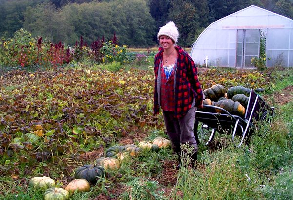
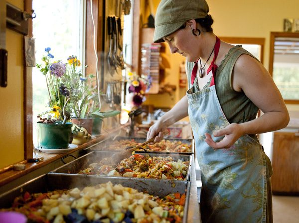

As the sun sets over the Centre, twenty beautifully carved pumpkins glow on the back porch, the remnants of the Centre's Halloween dinner party. This was a time to thank some dedicated people. Sofya Raginsky our Farm Manager, began with us three years ago and said at that time that she was hoping to buy her own land and start farming in three years. True to her plan, she is leaving the Centre this month to farm her five acres in the Fulford valley. She and her "soil sisters", Priya, Ali, Natasha and Coralie have worked tirelessly the whole season, rain or shine, to provide the Centre staff and guests with the tastiest, freshest organic produce available - zero mile food too. We will miss them. Our thanks to all of them and our best wishes for Sofya's new venture.

The fresh produce is only the first half of the Centre food story - the kitchen staff then transform this into meals that are both beautiful and delicious. When guests fill in evaluations after their stay, they almost always mention the wonderful surroundings and peaceful feeling at the Centre, along with the happy, friendly and efficient staff, but when they come to rate the food, the word "amazing" appears frequently. Quite simply, guests love the Centre food. Much credit for this goes to the Kitchen Manager, so a considerable debt of gratitude is owed to Kari Mathieson, our Kitchen Manager for the last six years. She has now stepped out of that role but we hope she will return to cook some program meals in 2012. Kari is known for the care and attention she gives to meals and for the serene environment she brings to food preparation. Indian sages have said that one can tell the thoughts of the cook when eating a meal, so the environment that Kari brought to the kitchen brought tranquility not only to her helpers but also to all those fortunate enough to be fed by her. Her patience, humility and peaceful manner have been an example to all Centre staff. We will miss her.

Since it seems to be a time for thanks, there are other people who deserve our appreciation but who may not be well known. These are the longtime members of [Dharma Sara](https://saltspringcentre.com/about/dharma-sara-satsang/), some of whom were founding members while others joined a little later. The contribution of these early karma yogis is hard to overstate. Many gave up careers and other pursuits to help make the Centre what it is today. Touched in some ineffable way by [Babaji](https://saltspringcentre.com/about/baba-hari-dass/)'s subtle magic they grasped the joy of selfless service and have passed on a legacy of karma yoga that has been unbroken for almost forty years. Some are still contributing to Centre activities, while life has taken others to distant places and diverse occupations. Relative newcomers may not know much about the Dharma Sara pioneers, and even our occasional guests are often very curious about the Centre's history. To illuminate this part of the Centre's past, we are beginning a series that profiles some of our longtime members. Each month will feature someone whose contribution to Dharma Sara has gone on for many decades, and who better to start with than Sharada Filkow who has lived at the Centre for close to twenty nine years and continues to give her time and guidance to succeeding generations of karma yogis. Look for more old members' stories in upcoming issues of the Newsletter.
With just one [Yoga Getaway](https://saltspringcentre.com/retreats-programs/yogagetaways/) to come (November 11th-13th) our season comes to a close with our Celebration of Service and Gratitude (November 18th-20th). If you have volunteered for the Centre and wish to attend please fill in the [registration form](https://saltspringcentre.com/season-closing-celebration-registration-form/). We hope to see you soon.
In Peace,
Shankar
