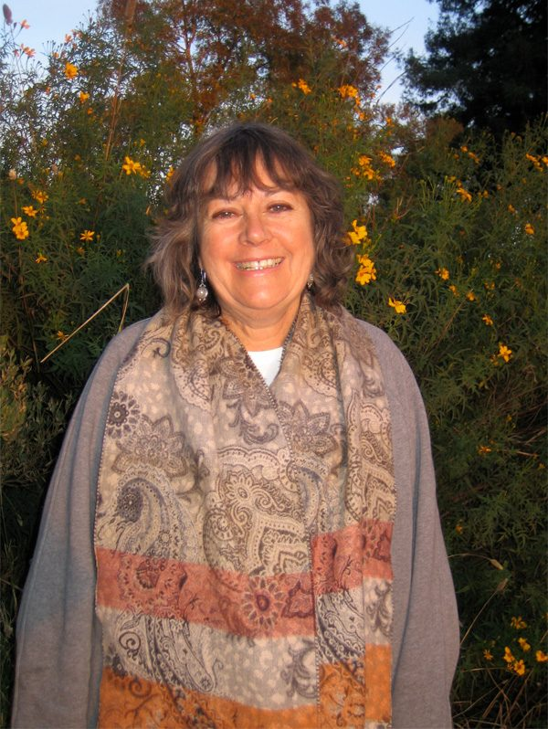
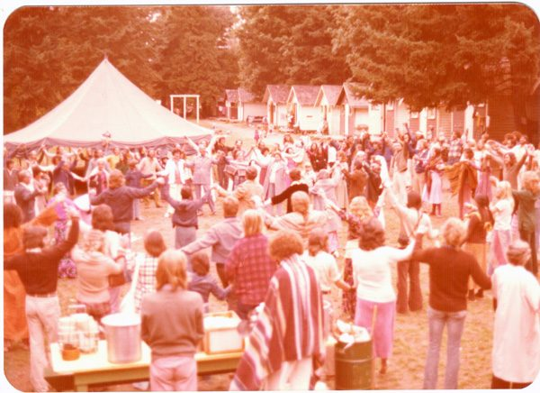
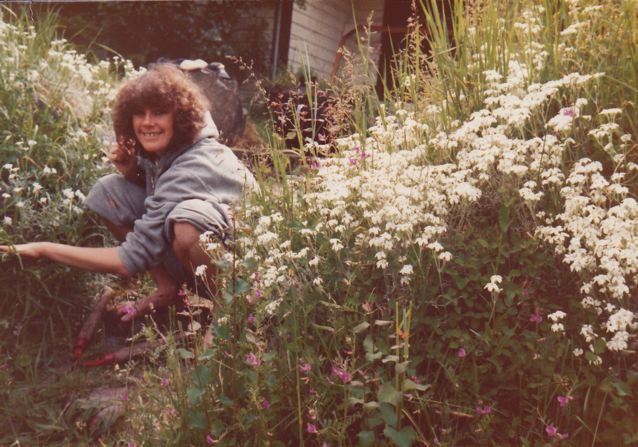
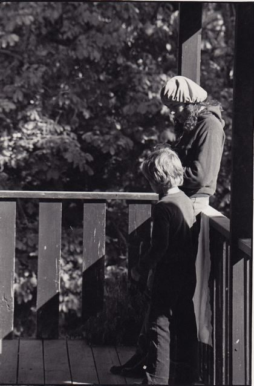
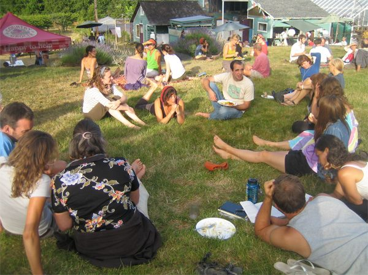
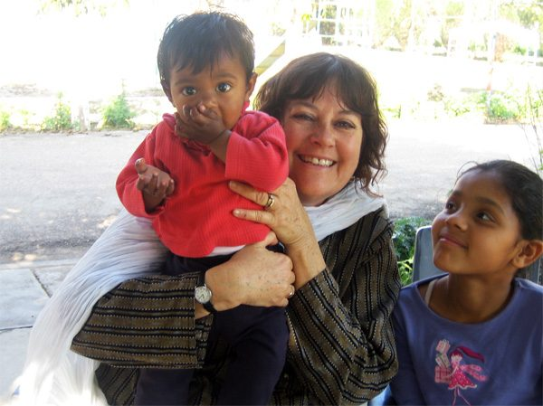

Continuing with our Founding Member Feature series which began last month with [words from Sharada](https://saltspringcentre.com/2011/11/founding-member-feature-sharada-filkow/), this month we hear from Lakshmi McPhee. Our hope is that these stories will help to illuminate part of the Centre’s rich history.
[caption id="attachment\_3847" align="alignnone" width="600" caption="Longtime member, Lakshmi"][/caption]

## Life Before Babaji

I am from Cape Breton, Nova Scotia and grew up going to Catholic schools, ceilidhs and lots of family gatherings. There was a strong sense of values, family and community which eventually lead me on a journey to find a spiritual community that I resonated with.
As a university student in 1970, I travelled to the Rocky Mountains for a summer job and experienced a counter-culture movement with exciting new ideas and ways of being. This deeply affected me and I soon graduated from university and left Nova Scotia to pursue a different lifestyle.
I grew up on an island near the ocean so I gravitated to the BC Gulf Islands and lived a very alternative lifestyle. My only son Sean was born on Salt Spring Island in 1974 and, although life was very enjoyable, I felt that there was something missing.....

## First Meeting with Babaji

[caption id="attachment\_3852" align="alignnone" width="600" caption="The grace circle at the White Rock yoga retreat in 1975"][/caption]
Like many young people my age, I had read the book *Be Here Now* and was intrigued by a picture of a yogi from India named [Baba Hari Dass](https://saltspringcentre.com/about/baba-hari-dass/). Shortly after that, in August 1975, I heard that Babaji was going to be at a [yoga retreat in White Rock](https://saltspringcentre.com/2011/07/37-years-of-yoga-retreats/), BC. That was the first [Dharma Sara](https://saltspringcentre.com/about/dharma-sara-satsang/) (DS) Yoga Retreat. I felt a deep calling to go and I hitch-hiked to White Rock with my young son in a snuggly pack. When I got there, there were no posters or signs to locate the event. (This may have led to my later obsession with brochure and flyer distribution for SSCY programs!) I went to the intersection and picked a direction to hitch-hike. The next car stopped and the people were going to the retreat! I arrived in the middle of Chandra’s traditional Indian wedding fire ceremony. Afterwards, we all formed a “grace circle” and that is when I first met Babaji.

## Joining the Dharma Sara Satsang Community

After the retreat, I had a private appointment with Babaji at Spruce Street house in Vancouver. This appointment changed my life deeply and profoundly in all ways. Through the interaction with Babaji, I knew without a doubt that I had found my spiritual teacher. I was at a crossroads in my life and asked what I should do next. He suggested that we move closer to satsang people and gave me the name “Lakshmi” and my son the name “Shyam”. I immediately went back, sold my houseboat on Gabriola Island and moved to Vancouver where most of the DS satsang members lived. I opened a family daycare centre in my home which Babaji named “Lotus Land”.
From 1976-1978, my son Shyam and I lived with other satsang people in a big house in Kitsilano and at the farm in Aldergrove that Sharada mentioned in [her story](https://saltspringcentre.com/2011/11/founding-member-feature-sharada-filkow/). These were my first experiences living in a spiritual community. We lived, ate, meditated, played and worked together. DS had a Yoga Studio, Rainbow’s End Day Care Centre and a store called Jai in Vancouver. The store was very profitable and we asked Babaji what to do with the income. He said to buy land and create a peaceful place where people can study yoga and ayurveda.
There were about 40 active DS members and we started looking for a place in different parts of BC. We could not agree on a place until, in 1981, we found the land which is now the Salt Spring Centre of Yoga (SSCY). We stood in a circle in the front field and looked around at everyone and realized that we had found our Centre. Babaji agreed that it was a good place so the work began of transforming an old, very run-down house and barn into a program house and school. We had work parties and did everything from weeding to renovations.
[caption id="attachment\_3848" align="alignnone" width="638" caption="Lakshmi weeding happily at the Salt Spring Island property."][/caption]
It was a family event and our children came as well.
[caption id="attachment\_3849" align="alignright" width="252" caption="Lakshmi and Shyam"][/caption]
Eventually, DS closed its yoga centre, daycare centre and store in Vancouver and many DS members moved to Salt Spring Island either to the SSCY or to buy their own property. Many DS members frequently travelled to attend classes and retreats with Babaji at Mount Madonna Center (MMC) in California. In 1980, I completed my Yoga Teacher Training (YTT) at MMC.
I also went back to university and took more courses in my educational field of English as a Second Language (ESL). Shortly afterwards, I met a woman at our DS Sunday satsang who was a Coordinator at the English Language Institute at UBC. She arranged for me to have an interview and I was hired and worked there for 31 years. During that period, I was very busy with my responsibilities as a single mom, ESL teacher and a student doing my Masters at UBC. As a result, I was less involved with DS.

## My Current Involvement with DS, MMC and the Sri Ram Ashram

Since 1988, as my family and work responsibilities lessened, I slowly became more involved again with DS. My husband Rajiv and I frequently attended the weekly DS Sunday satsangs in Vancouver and went over to do [karma yoga](https://saltspringcentre.com/karma-yoga-service/) at SSCY. Over the last 10 years, I have served on the DS Board, a number of SSCY committees and have coordinated the Annual Retreat, [Yoga Getaways](https://saltspringcentre.com/retreats-programs/yogagetaways/) and supported the [Yoga Teacher Training](https://saltspringcentre.com/yoga-teacher-training/) program in various ways.
This summer DS held its [37th consecutive Annual Retreat](https://saltspringcentre.com/2011/07/37-years-of-yoga-retreats/) and this is the main program which I coordinate. The format and length have changed and evolved over the years but the main components of the program have remained the same. It offers classes in classical ashtanga yoga as taught by Babaji. There is also a program for children so families can attend. It is a wonderful multigenerational event with guests and KY staff of all ages.
[caption id="attachment\_3846" align="alignnone" width="600" caption="Retreat guests enjoy summer days at the Centre"][/caption]
The SSCY had its [30th Anniversary](https://saltspringcentre.com/2011/08/100th-30th-anniversary-open-house/) this year which was another milestone. Over the years, I have frequently stayed at the SSCY for a few days up to a couple of months. I love the spirit of selfless service, community and generosity of spirit that exists between the people living or volunteering at the SSCY - whether it is for a short or longer period. The guests often comment on how they are touched by the energy of the staff and peaceful environment at the SSCY.
Babaji has written numerous books and has requested that the proceeds be used to establish a home for abandoned and destitute children in India. [Sri Ram Ashram](www.sriramashram.org ) ( SRA) was founded over 20 years ago and is a permanent home for 70 children, a school for 550 children from SRA plus 5 surrounding villages and a charitable medical clinic. This is a project close to my heart and I have visited SRA four times since 1997.
[caption id="attachment\_3850" align="alignnone" width="600" caption="Lakshmi visiting the Sri Ram Ashram in India"][/caption]
I have recently retired so that I can devote more time to attending classes with Babaji and doing karma yoga service at SSCY and MMC. My husband Rajiv and I are currently at [Mount Madonna Center](http://www.mountmadonna.org) in California until February, 2012.
As I reflect back on my life, I feel the good fortune and blessing of having a living teacher who has guided me with profound wisdom and compassion on my spiritual journey as well as through crucial life decisions. This is what has helped me to develop a peaceful life and more equanimity of mind for the challenges that life can bring. I have much gratitude and deep appreciation to Babaji for the gift of his teachings and presence over the years.
