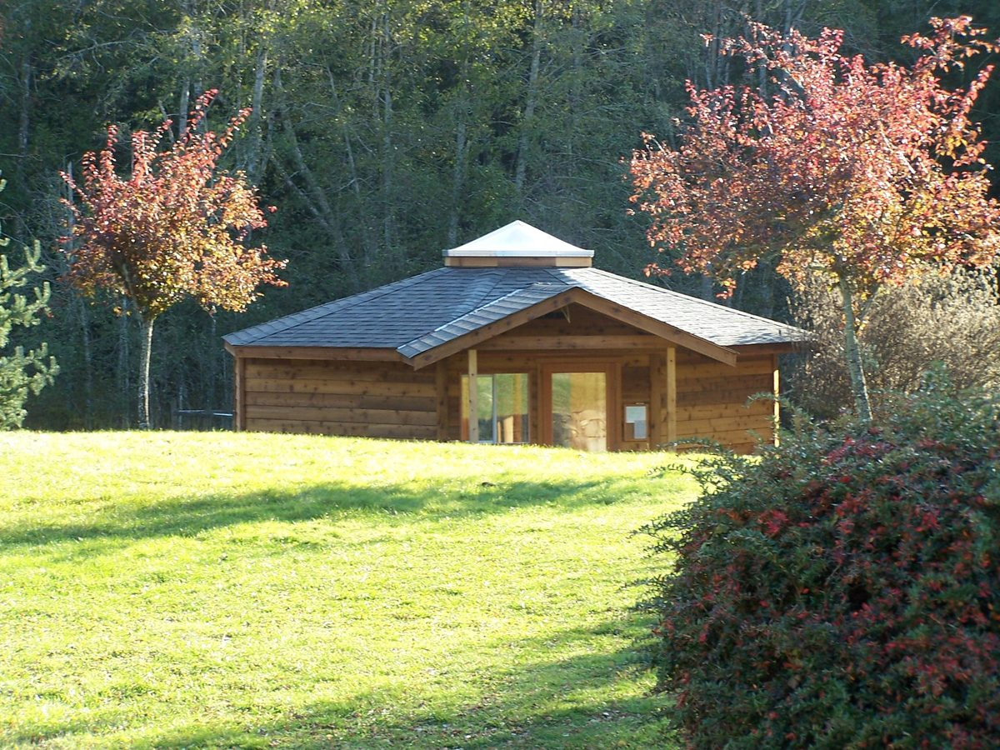
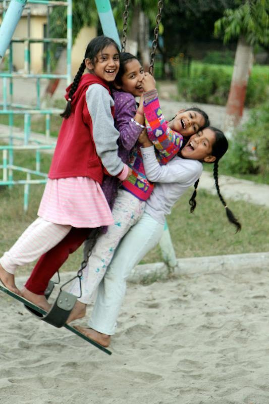

Dear Friends,
Greetings of the season to you all!
As we reflect on the blessings of 2011 and the year draws to a close we are making an appeal for your help in two of our important endeavours.

First, we are making an appeal for your contributions to the [Salt Spring Centre of Yoga](https://saltspringcentre.com/enter.htm). The work at SSCY is done largely by volunteers in the spirit of karma yoga. Our full time resident administrative staff received an average annual cash remuneration of about $3,500 in 2011, while those in the KYSS program exchange their work for room, board and classes. Their generous contribution of time, along with that of our volunteer boards and committees, enables us to keep program fees affordable and fund non-revenue producing programs and events.

Nevertheless, it is challenging to come up with funds for needed facility repairs and improvements. In 2011 we completely renovated the yurt, upgraded guest accommodation, built new composting outhouses for the campgrounds, greatly expanded the irrigation pond, and have just doubled the available electrical power to the program house. To protect against increasingly frequent power outages we have also purchased a large new generator. In 2012 we hope to expand KY housing, upgrade kitchen facilities, continue to improve guest accommodation and upgrade farm irrigation systems. There will no doubt be other expenses that we have not anticipated!
Secondly, we are asking if you can participate in our annual gesture of support to [Sri Ram Ashram](http://sriramfoundation.org/) in northern India. Each year [Dharma Sara Satsang](https://saltspringcentre.com/vancouver.htm) and the [Salt Spring Centre of Yoga](https://saltspringcentre.com/enter.htm) make a financial contribution to the children’s home, school and medical clinic inspired by [Baba Hari Dass](https://saltspringcentre.com/babaji.htm) and founded in 1984. This year we would like to raise a minimum of $6000 for this most worthwhile project to help provide medical and health care, food and clothing as well as educational supplies such as books and computers.

## Donate today

There are three ways to make a donation:

1. Donate online through [CanadaHelps.org](http://www.canadahelps.org/CharityProfilePage.aspx?CharityID=s17312)
2. Phone us with your credit card information at <250-537-2326>
3. Send a cheque made payable to “Dharma Sara Satsang Society”, with “Sri Ram Ashram” or “Salt Spring Centre of Yoga” in the memo, to 355 Blackburn Road, Salt Spring Island, BC, V8K 2B8

Official receipts for Canadian income tax purposes will be issued by CanadaHelps.org (if you choose option 1 above) or Dharma Sara Satsang Society (for options 2 or 3).
With gratitude,
The Board of Dharma Sara Satsang Society
