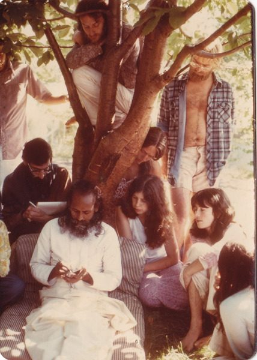

Over the years Babaji often commented on the importance of community life as a place to practice karma yoga and cultivate positive habits. He was also very aware of the difficulties that arise when people from diverse backgrounds live and work together – this is the grist for the mill of spiritual practice. In a community of people of different ages, cultures and backgrounds, our self-centredness is reflected back to us more often, providing the opportunity to recognize and reduce our negative tendencies. When one person’s self-interest conflicts with the interest of the Centre or of another person, there is a friction that arises from thwarted desires, which can manifest as anger in its various forms. Because of this, community living can be difficult and may not be a good fit for those who project their own negativity onto others in the form of criticism and blaming. Appropriately, the Sanskrit word tapas, usually translated as austerity, also has the meaning of heat, and refers to the conscious practice of limiting one’s desires. If one accepts responsibility for contributing to the conflict, then there can be spiritual growth. As Eknath Easwaran says, if you find a person to be annoying it is because you are annoyable. Taking responsibility for one’s own negativity and striving to remove even subtle forms of anger like frustration, impatience and irritability, lead to a quieting of the mind. Over the years Babaji has commented on the difficulties as well as the spiritual benefits of living in a community. Here is some of his sage advice.
> Selfless service is the best way to attain mental peace. Do your duty in the world and surrender to god - that's all. Simply living in a community with an attitude of selfless service can, by itself, bring peace.
> The land needs caretakers in different areas otherwise there will be no land, so the best way of attaining peace is to do karma yoga. It serves two purposes, first, it takes care of the world, and second, it creates non-attachment to the world.
> The Salt Spring Centre of Yoga is a spiritual community based on yogic discipline. The aim of the community is to attain peace within and without. The purpose of the community is to mould the young generation with spiritual life by presenting a good model of their own lives. Children learn more by copying adults than by being told what to do. Karma yoga or the yoga of selfless service is the best method of removing egocentric desires and attitudes which are the cause of human miseries.
> The Centre represents a place where people can build their own positive nature and mould others who participate at the Centre.
> People who don't adjust to life in a community will remove themselves in time. In a community everyone's dharma is to work honestly and faithfully in any area where there is a priority.
> Those who don't want to adjust to life according to the community rules are not a good fit for living at the Centre.
> In a community there is always work - just as in a family the parents are always busy doing things. In a family, parents don't mind working because they have their self-interest. In a community there is no self-gratification. Sometimes the hard work of a person is not even acknowledged, that's why it is karma yoga.
> In all centres there is a crisis everyday because individuals' problems come up and reflect on the centre. This is a process of learning and becoming non-attached to other people's problems.
> Everyone sees the Centre according to their own self-interest. If every member would see the Centre's interest then there would be no problem. There is no problem in the working system of the Centre, but people are not ready to give their time due to their own things in the world.
> People always blame, no matter what you do. If all rules are removed then someone will say it is a centre of hippies. If you create yogic discipline they will say it is too like a church. Blaming will never stop no matter how good the Centre becomes.

As the Buddha said: “People will blame you if you say too much, people will blame you if you say too little, people will blame you if you say just enough. In this world no one escapes blame.”
