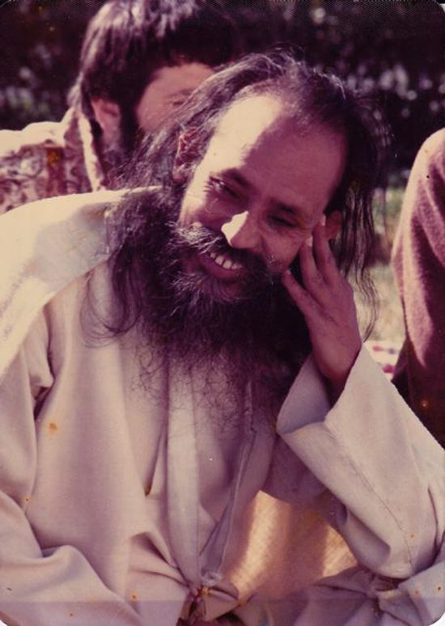

 Babaji, 1975
When someone asked Babaji a question about the right way to live, he said, *by lessening our demand, adding that demand increases desires and desires make demand, which creates dissatisfaction. Dissatisfaction makes pain. I don’t say cut your demands altogether. There are some essential demands to live in this world, like food, clothing, place to live, friends, etc. A carpenter can’t work without his tools.*
*Nobody wants to live in pain, and to live in peace we need four important things: 1)**equality, 2)**contentment, 3)**right thinking and 4)**good association.*
**Equality** means *to keep the mind in balance while getting sensual pleasure or pain* - or we could say, remaining equipoised in any situation, no matter what happens. It also means *to deal with others equally without having any selfish motive, recognizing that we all are one though in different shapes and forms like a potter makes different kinds of pots but the clay is the same.* The intention is to remain unattached while living in society.
“Unattached” is not something we usually think of as a positive thing, so let’s look at it more closely. It does not mean keeping one’s distance from others, being unfeeling or uncaring. Rather, it means being unattached to having things turn out the way we want them to. Sometimes they do, sometimes they don’t; can we remain at peace either way?
**Contentment** means to be okay with what is. *Neither desire anything for your enjoyment nor reject a thing which is already coming to you. Enjoy it as it is.* What if what is coming to us is not safe or does not promote our well-being? Does this teaching mean we simply have to be content with it and not do anything? The answer goes back to what Babaji said earlier, that there are some essential demands, or what might be called life-serving needs or values. These include safety and well-being. We do not become resigned (and possibly resentful); instead we are free to make wise choices when we accept what is, in this moment. In another darshan Babaji told someone, *You know you can’t have a younger body. You can accept this fact either painfully or cheerfully.*
**Right thinking** means truthful thinking, and asking “Who am I?” It is contemplating *how the illusion of the world is growing inside me. One who thinks on this never gets attached to any person, place or thing.* ‘Not getting attached to any person, place or thing’ does not mean leaving relationships or avoiding society. It’s an internal practice, regardless of where we live and what our work in the world is. We can take care of all of our responsibilities in the world while remaining focused on our aim of living in peace. When we do that, all our relationships benefit. Babaji instructs us to *be in the world but not of the world.*
**Good association** means keeping *the company of those people who are trying to be free from the illusion of this world created by the eight chains which have bound the jiva (the individual self) to this ignorance.*
*The eight chains are: 1) fame, 2) attachment, 3) affection, 4) hate, 5) suspicion, 6) fear, 7) timidity and 8) reproach.**When these chains are broken, then the jiva gets eternal peace. It’s difficult but we have to practice it because we want to live in a right way.*
Babaji has said that **fame** is the biggest trap and the hardest to get free from. Why? Because our egos thrive on praise and adulation. We tend to think of fame as something that only celebrities deal with, but it’s not so. Fame doesn’t have to be on a grand scale to dig in its talons. We love being recognized and praised for something we happen to be good at - and we take ownership of it. It’s a golden chain because it’s so alluring, so we have to watch these minds of ours closely.
**Attachment** can come in different forms. We can be attached to things, to our partners and families and to our identities. It’s very easy to fool ourselves by calling our attachment love. There may very well be love there, but love is unconditional whereas attachment has specific requirements: Love is open and flows from our hearts with no strings attached; attachment says, (although perhaps not so blatantly): Here’s the deal. I love you, but this is how I want you to be and what I want you to do.........(fill in the blank), and if that changes, the deal is off. Of course this is a very big and complex topic –we need boundaries and agreements in relationships, otherwise we cannot function well in the world. As Babaji says, philosophy is not practicality!
Attachment to our identity is very subtle because we’re often not aware of it. The big test comes with death. How attached are we then? Regular sadhana can help prepare us for this transition.
Why is **affection** on the list? Isn’t affection a good thing? Affection supports healthy relationships, and Babaji talks frequently about developing positive qualities, so why is it one of the chains? It’s difficult to separate affection from attachment, and may be seen as one face of attachment, yet with its own flavour. It is problematic when it becomes obsessive or causes us to create attachment to some and separation from others.
**Hate** of anyone or anything clearly separates us from others, except perhaps for those who agree with us. We can feel so self-righteous! The one who hates another is convinced of his own rightness, naturally making the other wrong. That kind of rigid thinking harms us more than it harms the other because it seals us off in our private compartment of negativity and suffering.
**Suspicion** is a variant of both fear and hate. Living with a lack of trust, one is alone and fearful of what might happen. It brings pain from the past into the present, where one may suffer from a sense of scarcity, and be constantly on the lookout for enemies. Suspicion manifests visibly in the political arena, but it can also show up in our day-to-day lives on a smaller scale. Whether global or personal, suspicion is a kind of poison that keeps us from connecting honestly with others.
**Fear** shows itself in thousands of forms, from stage fright all the way to fear of death. In fact, all fear is based on the fear of death. All the little ego deaths - when someone criticizes us or even looks at us in a funny way, doesn’t answer our emails or phone calls, forgets our birthdays - bring up fear. ‘Does that mean the other person doesn’t like me?’ We may feel angry – even assuming it’s the other person’s fault - but that’s another face of fear - defending these egos that are terrified of extinction.
**Timidity** is a variant of fear, but it has its own flavour that distinguishes it from fear in general. Timidity is an attitude of walking through life in fear of making a mistake. When we are afraid to make mistakes - or be seen to be doing something wrong - we are less likely to stand up for our convictions. ‘What if someone doesn’t like what I say? Maybe I shouldn’t say anything.’ This timidity keeps us trapped, afraid to speak up for what’s important to us.
**Reproach** means expressing disapproval, judging someone as wrong. The damage comes from seeing ourselves as better than the other person, judging the person rather than the deed. It is speaking to another from a place of superiority, and therefore hurts both the speaker and the one hearing the words of blame. In both cases, the result is separation.
All these chains, whether obvious or subtle, bind us in our illusory reality, and the goal of spiritual practice is to wake up from that illusion.
