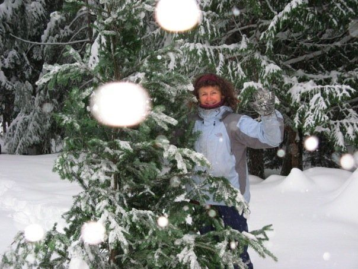
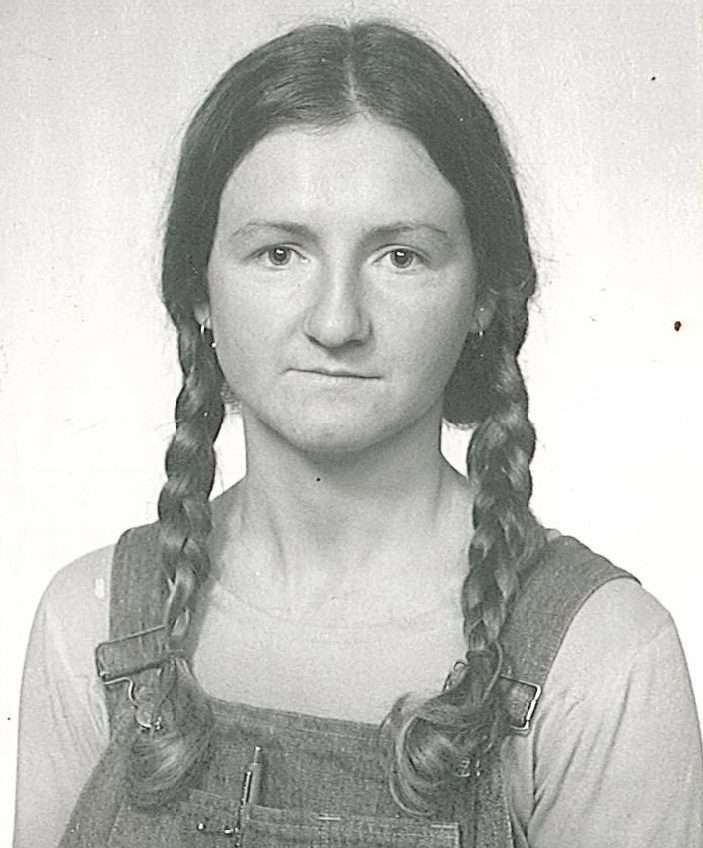
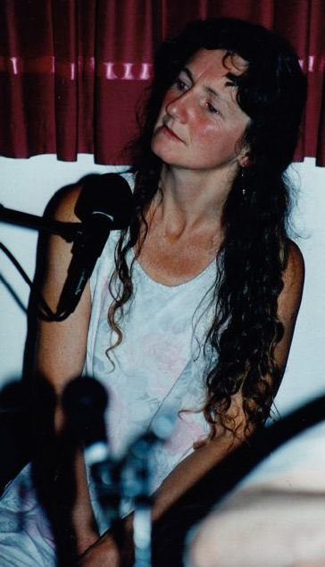
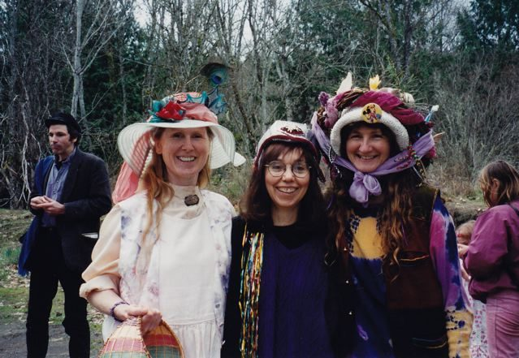
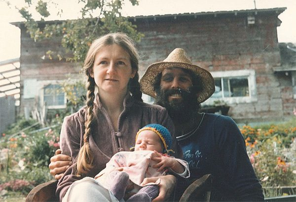
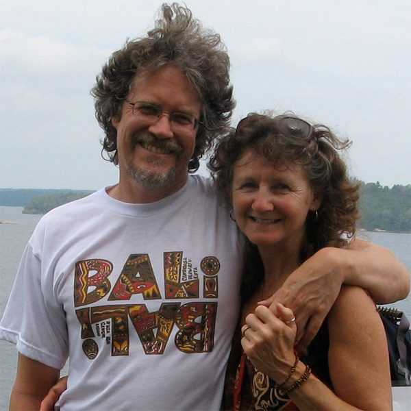
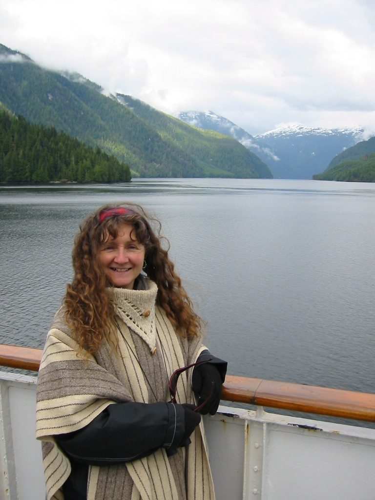

[caption id="attachment\_6143" align="alignnone" width="604"] Rajani on snowy Mt. Belcher[/caption]
My grandmother was a full-blood Apache Indian. Although I knew little about her, I deeply appreciated her ritual ways and the love she showed my own mother.
Our home in Ottawa included my parents, 3 brothers, 1 sister and myself. There were many aunts, uncles and cousins in and out of our house, as both parents came from large Roman Catholic families. I learned at an early age the responsibilities of caring for my siblings and mother, as our household was steeped in anger and violence, which led to my leaving home at the age of 17.
Church became my refuge as a young person, a prayerful place of quiet and peace. I frequently had thoughts of becoming a nun or missionary, wanting to help and serve people who were in need.
Meditation, massage, shiatsu and yoga became a part of my life during my late teens, during the upheaval of the late 60’s. I completed four years of Business and Commerce and worked as a legal assistant until I left Canada in 1971 and went to London, England with a one year open ticket which I bought for $99.
[caption id="attachment\_6224" align="alignnone" width="422"] Rajani the Planet Earth Cycles Mechanic - 1977[/caption]
Returning to Canada after five years away, I hitchhiked to BC, opened a bike shop called Planet Earth Cycles in the town of Mission, and became the first female bicycle mechanic for the Penticton Summer Games in 1978. I later signed on for a world circumnavigation on a 100-foot sailboat but after several wild storms I left the ship in Bermuda and returned to Ottawa.
In London I met my first husband, Lance, who worked with External Affairs. Shortly after getting married, we left for a two year posting in East Africa, then went on to two years in Rome, where eventually we separated. During this time I learned Swahili and Italian which I used in my volunteer positions in both places.
In Ottawa, massage and shiatsu were my livelihood along with managing a Spiritual Bookshop called Sunnyside Books, studying herbalogy, iridology, and various raw food diet practices. The bookstore was a rich resource with books by Alice Bailey, Ram Dass, Sri Aurobindo, Yogananda, Rajneesh and so many others.
A friend invited me to come to visit in Northern Alberta, so I headed off in the fall, building a small cabin and greenhouse on their land. I learned to play guitar, offering massage and working in the bush, driving logging trucks, cooking in bush camps and teaching yoga, meditation and nutrition to the community as well as men in the camps!
[caption id="attachment\_6227" align="alignnone" width="364"] Retreat Bhakti night singing - 1995[/caption]
When my mother was diagnosed with pancreatic cancer I returned to Ottawa and spent the next 10 months caring for her. The nurses at the hospital taught me the skills I needed, and this was the beginning of a career in caring for the ill and dying.
During another stint in Alberta, I returned to my little cabin in the early summer and began firefighting. Unfortunately, I came home at the end of one day to find my cabin had burned to the ground. I suspected the magnifying crystals hanging in my windows or the spontaneous combustion of a hay bale. I lived in a small tent until fall and then decided it was time for me to return to Ottawa.
Pramod, a friend of mine for many years, invited me to live in a communal house in downtown Ottawa. He was a student of Transcendental Meditation and was attending a Christmas yoga retreat in California soon after I moved in. During his absence, I began having dreams of an Indian man who also came to me in my meditations. I had no idea who this person was until Pramod returned from California and showed me a picture of the teacher he had gone to visit. He had met Baba Hari Dass and many other MMC residents, including Jaya, Sita, Janardan, and Sri Nivas (from Calgary). I wrote to Babaji and told him of my dreams, to which he responded, “come to MMC and do the YTT program.” That was 1983.
[caption id="attachment\_6140" align="alignnone" width="575"] Easter bonnet sisters - Anuradha, Sharada, Rajani - 1996[/caption]
So Pramod and I packed up everything and headed off to California where we completed our YTT program in June. I met Bhavani Chlopan in my YTT class and she told me she was from the centre on Salt Spring Island. When Babaji said he had plans for me at MMC, I told him I was Canadian and wanted to live in in Canada, so he said I should go to the Salt Spring Centre and become a permanent resident.
We headed to Salt Spring and as we drove up the centre driveway, I had a strong sense that I was coming home. The only light we saw was from Sharada and Sudarshan’s house. When we knocked at the door, I saw an old friend inside eating honey cake and drinking tea. It was Rosh Hashanah, September 7th, 1983, my 32nd birthday.
[caption id="attachment\_6225" align="alignnone" width="600"] Rajani and Rajesh with baby Mamata in the SSC garden - 1985[/caption]
Eighteen people lived in various places on the land and we moved into the Heart Room. We helped build the first school room in the basement, worked in the kitchen, filled pot holes and all the other basic tasks in a new community. The next spring I went tree planting with Chakrapani and when I returned in time for the summer retreat, I became kitchen in-charge.
That summer I met Rajesh and in November we were married, as counselled by Babaji. Our “Goddess of Love,” Mamata, was born in our cabin on the land August, 30th 1985 and my life was now completely different. I taught yoga and meditation at the centre and over the years I did many things: co-founding the healing centre; supervising the kitchen, garden and construction of the greenhouse and school building; and managing the karma yogis. I served on the various boards, wrote grant proposals with Sid (about a dozen in all) and drove the school bus for eleven years.
[caption id="attachment\_6226" align="alignnone" width="540"] Om Prakash and Rajani - 2011[/caption]
When Rajesh and I separated, I continued to live at the Centre -- until 1997 when Om Prakash and I got together and built a house on Mount Belcher where we still live. Mamata went to the Centre School from grades 1 to 9. She now lives in Victoria. I’m still here, doing treatments at Chikitsa Shala and helping with full moon yajnas, celebrations, organizing puja equipages, singing at satsang, helping with administrative duties when asked, and staying connected to the garden and the karma yogis.
I love the SSC land, and have walked every inch through every season of the year. I have submerged my hands in its rich soil and coaxed the green shoots into being in each corner of the gardens. It speaks to my heart. Daily sadhana is an important part of my life; that’s what supports me in continuing to work with people, especially those who are dying and their families. My whole life is spiritual practice. When Babaji told me about this place, the Salt Spring Centre, he led me to my true family. It’s a feeling of love, transcending the chaos of daily life for which I am ever grateful.
[caption id="attachment\_6138" align="alignnone" width="461"] Rajani, part of the Centre family[/caption]
