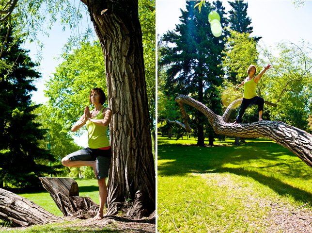
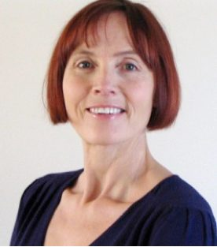

**Laura has generously made available excerpts from the diary she kept while attending the 2012 sessions of [YTT](https://saltspringcentre.com/programs-retreats/trainings/yoga-teacher-training/).** 
**Part 1 is published below, and you can [read Part 2 here](https://saltspringcentre.com/meet-our-ytt-grads-laura-harris-part-2/).**

## Diary of a yogi in training - Part 1

**July 3**
Arrived on Salt Spring Island by float plane, a noisy and exhilarating 20-minute flight from Vancouver Airport, in a 1956 Beaver Haiviland. The Salt Spring Centre of Yoga, where I will spend the next 2 weeks as part of a 4-week yoga teacher training certification (YTT-200hr) is nestled in a valley about 10 minutes from Ganges. I came here to have “the ashram experience”, surrounded by nature, immersed in the yogic experience, eating healthy meals, and doing lots of great yoga. At least that’s what I thought I needed.
**July 4**
Up at 5 am for my first session of pranayama. The practice of pranayama is regulating the breath in order to calm the mind, the guiding principle being a peaceful breath is linked to a peaceful mind. We learned the yogic breath today: a full inhalation and complete exhalation, maximizing the volume of air brought into the lungs. An hour of pranayama techniques was followed by a short meditation, then - chai tea! No food (except the wonderful milk-tea) is taken until after the yoga asana (poses) class, meaning, the first meal of the day is at 11am. A snack is served at 2:30pm and supper at 6:00pm. The food is lacto-vegetarian or vegan which means no meat, fish, or eggs. And no coffee either. The meals are just over-the-top good: fresh, organic, healthy and delicious. I will not lose weight here.
**July 5**
Today we began Shat Karma, or practices of cleansing the body, with an introduction to the neti pot. Neti, or nasal cleansing, involves pouring warm, lightly salted water in one nostril and letting it drain out the other. Many health benefits, as Dr. Oz and Oprah have publically attested. Neti will be part of our daily morning routine, along with other shat karma techniques. The afternoon and evening theory sessions for the next few days are anatomy, taught by a physiotherapist who is a long-time yoga practitioner and YTT graduate. The overlay of western science on the eastern spiritual practice of yoga is fascinating. So much is offered by both systems.
[caption id="attachment\_6213" align="alignright" width="276"] YTT Graduate, Laura Harris[/caption]
**July 6**
Introduction to Ayurveda; discovered I am of a predominately pitta dosha (positive qualities of mind: articulate, intelligent, enthusiastic. Negative qualities: irritable with anger flare ups, aggressive, prone to pride). Oh well, I can always balance my dosha with proper diet and yoga asanas! Ayurvedic cleansing diet and lifestyle offers a holistic and natural approach to maintain optimal health. Worth exploring further, I think.
**July 7 & 8**
Had an emotional meltdown on Saturday night; couldn’t relax and fall asleep after another very full day. Feeling vulnerable and overwhelmed by the long days, new people; not really sure why I’m here. It’s just way more intense and affecting me at deeper levels than I expected. Got it sorted out by talking with one of the very kind (and still awake) yoga teachers. Moved from a shared room into my own room Sunday night and slept like a baby. Many of us are hitting some kind of personal “wall” and it’s manifesting in different ways for different people. Interesting.
**July 9**
A daily highlight for me are the 2 yoga asana classes; in the morning we can choose between a beginning or intermediate level class while the afternoon session is an asana clinic where we cover 2 to 4 of the 28 classical poses then practice-teach them to one another other. The yoga teachers are exceptional: their teaching style is clear, concise, and often entertaining. I have had classes in: flow, power and restorative yoga, clinics on back bends, head and shoulder stands, and learned how to incorporate props (blocks, blankets, and straps) for added comfort and safety.
**July 10**
Today we were in silence (no talking) until 2:30pm. I could finally hear myself think after days of listening to instructions, theory, and general chattering. What I noticed when I observed my thoughts during the silence is the chattering of my own mind. Yet my inner self feels very settled and calm. This evening we enjoyed yoga in the “Pond Dome”, a large outdoor classroom with sides opened up to the surrounding meadow with sky, forest, mountains, birds and deer in the background.
**July 12**
The asana clinic today was Savasana (Shuv-awwsuna), a reclining pose lying on the back on the floor. Savasana is how we “seal” or conclude a yoga practice. It teaches us how to let go of tension in the mind and body, focus on our breath, turn the mind inward, and relax deeper still. Interestingly, Savasana is known as the most difficult pose because of the challenge of truly being still in mind and body. Savasana can give one the experience of being in meditation.
**July 13**
Last evening we were privileged to be part of Kirtan, a spiritual musical event where the musicians and audience engage in call and response to the words of the songs, many sung in Sanskrit. There were over a dozen musicians accompanying our voices: cello, violin, guitars, mandolin, flutes, drums, and percussion, creating a lovely, exuberant, full-of-life experience .
**July 15**
Returning to Saskatoon tomorrow. Looking forward to my family, garden, cats and familiar routines, wondering how I will maintain my new habits of daily pranayama, meditation, yoga, and vegetarian eating. I am leaving with a full mind and even fuller heart. My key learning from the past 2 weeks: yoga is a teacher.
**July 16**
Home for 3 weeks and back to Salt Spring Centre of Yoga for the second half of YTT-200hr!
 **[Continue to Part 2](2013/01/meet-our-ytt-grads-laura-harris-part-2/)**
 
Laura Harris, MSc is a wellness professional in Saskatoon with over 25 years of experience as an instructor, facilitator, and coach. She is the owner of Harris Wellness Consulting and Hatha Spirit Yoga Studio. For more information about Laura and to find out locations, times, and how to register for her yoga classes, please visit [hathaspirityoga.com](https://hathaspirityoga.com/) or call her at 306 292-7534.

### For information about the Salt Spring Centre of Yoga’s YTT program, visit:

[Yoga Teacher Training home](https://saltspringcentre.com/programs-retreats/trainings/yoga-teacher-training/)
