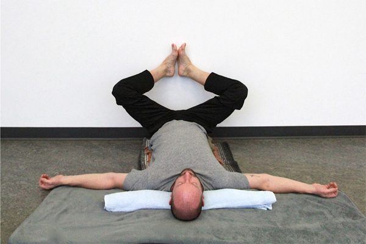
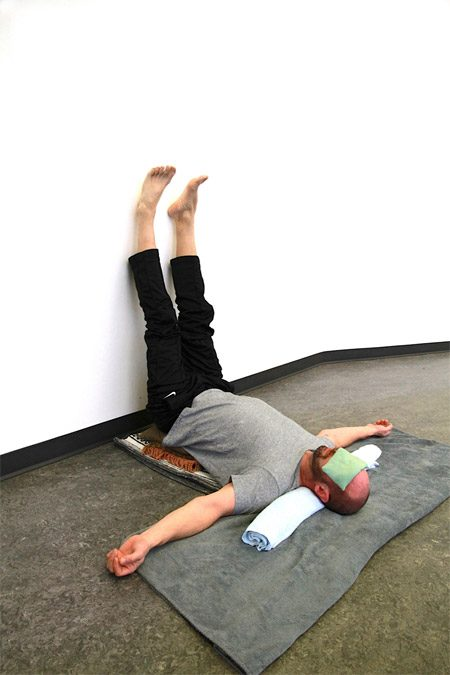

### Viparita Karani (legs-up-the-wall pose) **Viparita = inverted, reversed; Karani = doing, making**

 Viparita Karani
Viparita Karani is a wonderful yoga posture and a favourite of mine, one that I share with students any time of the year. This asana is particularly refreshing in the long dark months of winter. It is a nice inversion alternative
 to savasana pose and it’s calming for the mind and gently stretches the back
 of the legs, neck, and low back.

#### Benefits of  Viparita Karani

During the winter season when mild depression can affect some 
people, this asana practiced daily from 15 to 30 minutes can 
bring an overall grounding sensation while balancing the nervous 
system and introduces relaxation response. Tired legs and feet will
 definitely feel restored after Viparita Karani.
 The restorative nature of this posture gets blood flowing to parts of 
the body that need it, making it good for many ailments, including
 arthritis, menopause, high and low blood pressure and respiratory 
ailments.

#### Getting into the pose

To begin you’ll need two firm folded blankets or a firm bolster for 
support placed about 5-6 inches from an unobstructed wall. As
well, eye-pillows can be used for over the eyes and forehead. If 
you are stiffer in the hamstrings you will want to place the props 
further away from the wall, no more than 10 inches. To start, sit
 sideways on the middle of the prop with your right side close to the 
wall. As you begin to exhale turn to the right and let your legs
 move up the wall as you lower your torso and shoulders to the 
floor, looking up to the ceiling. Keeping your pelvis centred on 
the prop and comfortable for the lumbar, keep your legs relaxed 
and settled against the wall. Let your arms rest on the floor slightly 
lower than your shoulders or resting overhead on the floor. Your head should be positioned so that your forehead is slightly higher
 than your chin. For additional comfort use a small rolled towel for
 under your neck (without letting the head tip back) while following 
the breath slowly. Find the quietness of your belly and the
 spaciousness around your heart as well as the sensation of feeling 
held. Other props that you can use are a heavy blanket for covering 
the torso or a sand bag for the soles of the feet.

#### Coming out of the pose

When ready to move out of the pose, slide away from the wall 
coming off of the prop, and rolling onto your side. Take a few soft 
slow breaths before lifting up while exhaling.

#### Variations on the pose

Here are some variations to make this asana your own. Bend
 your knees and bring the soles of your feet together (like baddha
konasana) with outer feet against the wall. As well, try elevating
 the lower legs onto a chair with a foam block under your hips and a
 thick blanket under your calves. Alternatively, use what you have
 to support the lower legs horizontally and the feet touching the wall
 and a blanket or sand bag on the legs.
This is my favourite winter asana to help restore and strengthen mind
 body and breath. Include Viparita Karani in your personal yoga 
practice.

#### About the instructor

Peter Ashok Baragon graduated from SSCY’s Yoga Teacher Training ten years ago  and has been teaching in Vancouver and West Vancouver ever since.  He enjoys teaching at community based centres for the variety of participants and the opportunity to offer different styles throughout the week. Rooted in classical ashtanga yoga and hatha yoga, he also teaches yin, restorative, chair-yoga for seniors and power flow vinyasa. Teaching for him flows from a place of love, compassion and gratitude.
