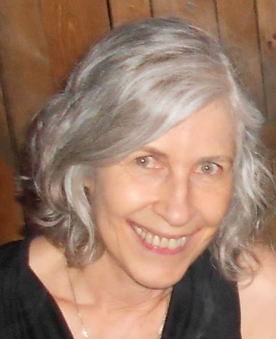
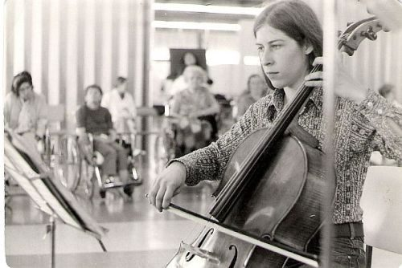
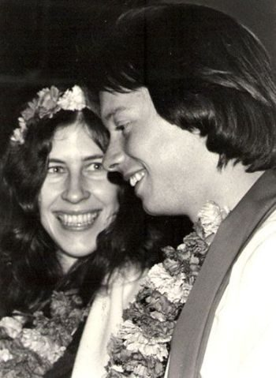
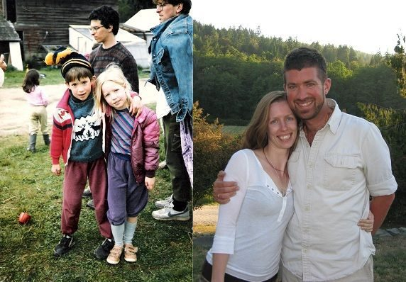
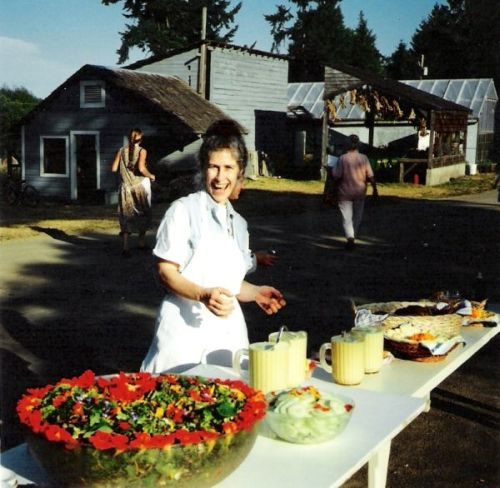
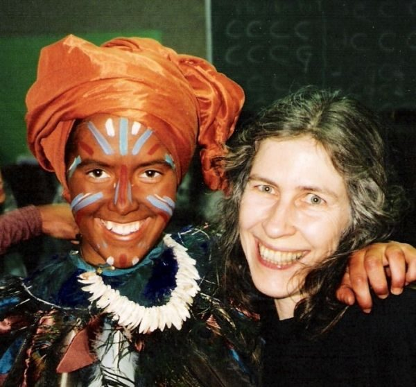
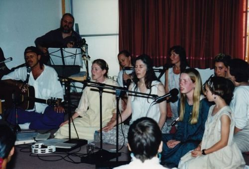
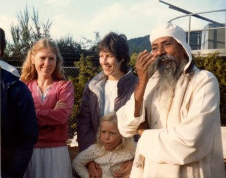
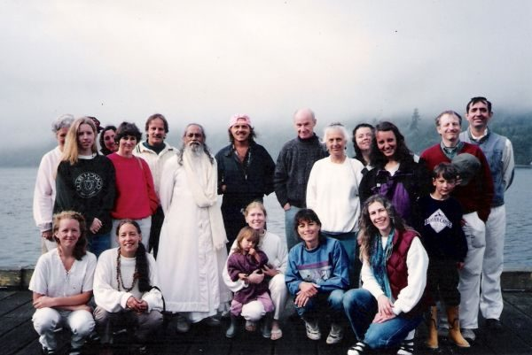
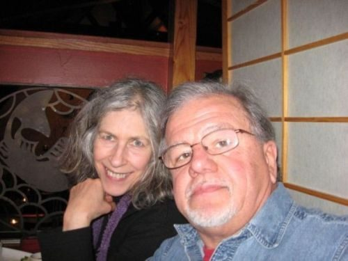

 Mayana, part of the Centre family
When I saw the blue poster, I knew my life was about to change. It announced Dharma Sara’s first Yoga Centre on 4th Avenue in Vancouver, and when I read it I thought, “That place is going to save my life.”
It was 1976, I was a musician and a teacher, and I had studied music at UBC, travelled around the province playing cello in a string quartet, lived communally with people I loved, learned yoga from a book and practiced it every day. But I was lost, and after a brief marriage during my student years I knew something was missing, I just didn’t know what.
 Mayana playing for a Vancouver “Music in the Hospitals” tour - 1974
I went to Sunday Satsang not knowing what to expect and found a room filled with warmth and friendship. Sharada walked right up to me when I came in the door, and said, “Hi, I’m Sharada!” with a big, welcoming smile. I felt part of the group from the moment I walked in.
I loved chanting, loved the ritual, and loved the community. Most of all I knew I was in the right place, knew Baba Hari Dass was my teacher and was excited to meet him when he arrived in the summer for what would be the second annual DS summer retreat. What was it like to meet Babaji? My heart cracked open and tears poured down my face when he walked through the arrivals door at the airport. I loved him instantly.
A group of us moved into the Trutch Street House where I lived with my sister Mandira, Anand Dass (AD), Kalpana, Lakshmi, baby Shyam and five other adults. We lived together as “family” and it was an extraordinary time as we fit together the lives of ten people who had yoga and Babaji in common and not much else! Learning to live together began a process of smoothing out our rough edges that would continue for many years. AD chanted OM every morning at 5am in front of the big puja table in the main room with anyone who got up early enough to join him.
 Wedding fire ceremony - 1977
I met Bishambhar when he came to choir practice at Trutch Street and we were married in 1977. The wedding was at a temple in Burnaby and the reception in our Centre behind the first Jai store. The next year Radhika was born. I loved being a mother, yet continued to be challenged by a back injury that had kept me bedridden most of my pregnancy. I had major surgery and doctors couldn’t explain why I didn’t recover in the months that followed. In my search for answers I met a healer who had been through something similar. From her I learned there are many dimensions to getting well, and I knew if she could do it then I could too. Learning to heal myself was another spiritual awakening for me.
By the time I was well Bishambhar and I had separated, the land scouts had found property on Salt Spring Island for the Centre and work had started to get the building ready for programs and retreats. Radhika and I stayed in Vancouver making trips to the Centre whenever we could. We continued to have Satsang in Vancouver. I taught music and we lived with Satsang folks at the Laurel Street House, and then with Chandra, Al and their boys Ramesh and Gabe. AD thought it was a miracle that my back had healed. I told him it wasn’t a miracle, just a lot of hard work, yet recently I’ve come to think we were both right.
 Our children grew up together. Radhika and Ramesh - 1984 and 2007
I loved parenting with other moms. Sharada, Chandra, Sadhana and I all had babies around the same time and whenever we were together those kids had four “Mums”. It was common to hear someone say, “Go ask Mummy Sharada” or “Mummy Chandra will help you with that”. Adults got their work done and children were happy. Radhika told me a few years ago, “You always knew which one was yours. That was the one you went home with.”
Right from the beginning whenever we were at the Centre I worked in the kitchen, and after we moved to the Island in 1987 the kitchen continued to be at the core of my karma yoga. I loved Rajani’s women’s crews and later cooking with Vasudev. Once when I wavered about what I should be doing for my spiritual development Babaji told me, among other things, “The Centre is there for your karma yoga.”
I took charge of the kitchen, first for summer retreats, then year-round. The kitchen became the centre of the Centre for me. My private moment of the day was in the evening after everyone was in bed and all was quiet. I would go to the kitchen to do a late night check and look at the next day’s plans. After the organized chaos of the day the hush was palpable. We once had tee shirts that said, “Find peace at the centre.” I found peace in the kitchen.
 Mayana preparing for dinner - 1994
In the early days Babaji told me, “Do music.” Music had always been my life and my livelihood, and in kirtan my heart opened when I sang to God. I played harmonium and gradually led more kirtan, my voice refining as I gained confidence. In productions of The Children’s Ramayana—a musical with more than 70 children, a choir and a band—I found another place to throw my heart into music, teaching actors their songs, singing and directing the choir.
 Backstage with Guha at a Ramayana performance - 1995
 Singing for Bhakti Night – mid 1990s
Every summer we prepared for Babaji’s retreat visit with great excitement. During the retreat, time seemed suspended. We worked hard running the retreat. We enjoyed quiet focused classes, the sweetness of kirtan in Babaji’s presence and the fun of tea-time on the mound. When the day came that he was to leave, everyone gathered in the parking lot to say goodbye. But some weren’t ready. We jumped into cars and headed to the ferry to visit in the parking lot, then onto the ferry where we gathered around his car for more, and finally to the airport for the last sweet moments as we waited for the boarding call, and then waved as they boarded the plane.
 Mayana, Anuradha and Radhika waiting for the ferry with Babaji – 1984
 Waiting for the ferry – 1993 (Mayana bottom right)
One year at the airport we found ourselves on one side of a wall with Babaji on the other. The top half of the wall was glass, so we could see him waiting to board the plane. But the line wasn’t moving. We watched Karuna and Bhavani and others chatting with Babaji and waited to wave them off. Babaji turned, looked at us for a long moment and then ducked down so we couldn’t see him. A minute later he popped up with a look that said, “Here I am!” He was playing peek-a-boo with us! Just the way we did with our children when they were small. It didn’t matter that we weren’t children. Every time he popped up we laughed and were as delighted as two year olds. We imitated him and there was peek-a-boo and laughter on both sides of the wall. “Play,” Babaji has told us again and again, and that day was another reminder of how easy it is to play anywhere, anytime.
I am blessed with Babaji’s teachings, and with the Centre as my spiritual home. Chandra said it eloquently: “Babaji shone light on the teachings of classical Ashtanga Yoga for us all and gave us a path for life.”
 In December, 2008 Kurt and I married and we have been away from the island to be close to his work. We hope to spend some extended time at the Centre in the future.
