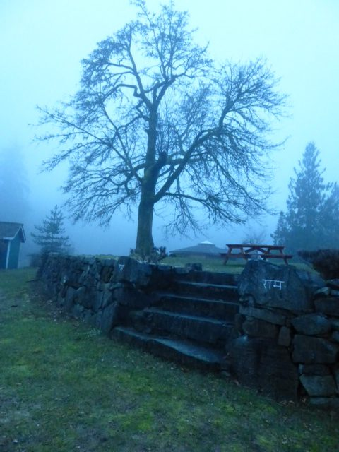
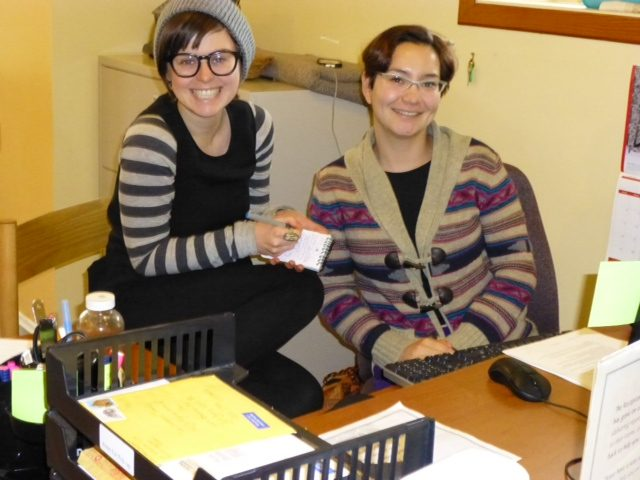
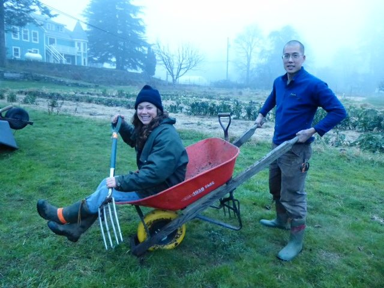
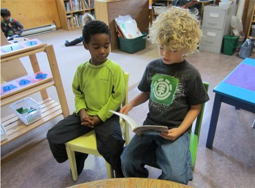

 The big maple tree on the mound in the fog.
Although the weather is still wintery, there’s a touch of spring, of newness in the air. It’s a bit chilly, but the days are getting longer. The darkness of winter is not always something we’re grateful for, but without it we wouldn’t be able to experience and enjoy the gift of the light’s return.
The farm isn’t yet displaying its abundance, but the abundance is there in the form of seeds, just as abundance is always present in seed form even when we can’t see it. Spring seeding is beginning in the propagation greenhouse in preparation for the explosion of growth in the coming season.
Although the Centre’s resident community is still small, it is also about to begin growing. Two new people will be arriving (may already be here when you read this) to contribute their skills in the office, as registrar and programs manager.
In the past months a number of renovations have been completed, notably the drywall in the basement and the waterproofing of the dish room. There are, as always, other items on the never-ending list, but the big ones at the top of the list are being checked off. Everything looks great.
 Cailin training Laura, our new registrar
We are on the lookout for a small pickup truck in good condition, to serve the needs of our farm both for on-land use and to take produce to Salt Spring’s famed weekly Saturday market. If you have one you’d like to part with or know someone who has one to sell, please contact the Centre office. Also, take note that we still have space for some enthusiastic karma yogis for the first term of our KYSS program, March 17 - June 3. If you know of anyone who would love this opportunity - or if you would - [check the Centre’s website for details](https://saltspringcentre.com/karma-yoga-service/).
 Tara and Jack gardening in the fog
There are a number of features in this newsletter I invite you to read. This month’s founding member profile is of [Mayana Williamson](https://saltspringcentre.com/2013/01/founding-member-feature-mayana-williamson/), whom many of you will remember from her many years of involvement in Dharma Sara and the Centre. The Meet our YTT Grads article features [part two of Laura Harris’ wonderful ‘diary of a yogi in training’](https://saltspringcentre.com/2013/01/meet-our-ytt-grads-laura-harris-part-2/), describing her experience of the second session of YTT to her graduation. We’ve added another new feature this month as well: Asana of the Month, focusing this time on [Viparita Karani - legs-up-the-wall pose](https://saltspringcentre.com/2013/01/asana-of-the-month-viparita-karani /).
This year's [Shiva Ratri](https://saltspringcentre.com/2011/01/shiva-and-shiva-ratri/), the Night of Shiva, an all-night vigil of chanting and ritual in honour of Shiva, the destroyer of illusion, is scheduled for March 10 through to the morning of March 11. [Find details on our blog](https://saltspringcentre.com/2013/01/shiva-ratri-2013/). Don’t be daunted by the prospect of staying up all night chanting; you are welcome to come to all or part of the night.
 Reading month at the Salt Spring Centre School
February is a very busy month for the [Salt Spring Centre School](https://saltspringcentre.com/about/centre-school/) - reading month and off-screen challenge (probably harder for adults than kids!). Reading month for kids isn’t the same as reading week for university; it’s more of a competition, working in teams, to see who can read the most books - and remember the facts, for the final Battle of the Books quiz, an event the kids love. Two other Centre School traditions also fall in February. On Hundreds Day, the hundredth day of the school year, you can find collections of one hundred items of all kinds throughout the school, contributed (and counted) by the kids. Also, Lunar New Year is celebrated in early February, with the traditional dragon parade and a noodle lunch, complete with chopsticks.
As we move from winter into spring, may our lives open to growth and abundance.
With warm wishes for continuing light in our lives,
Sharada
