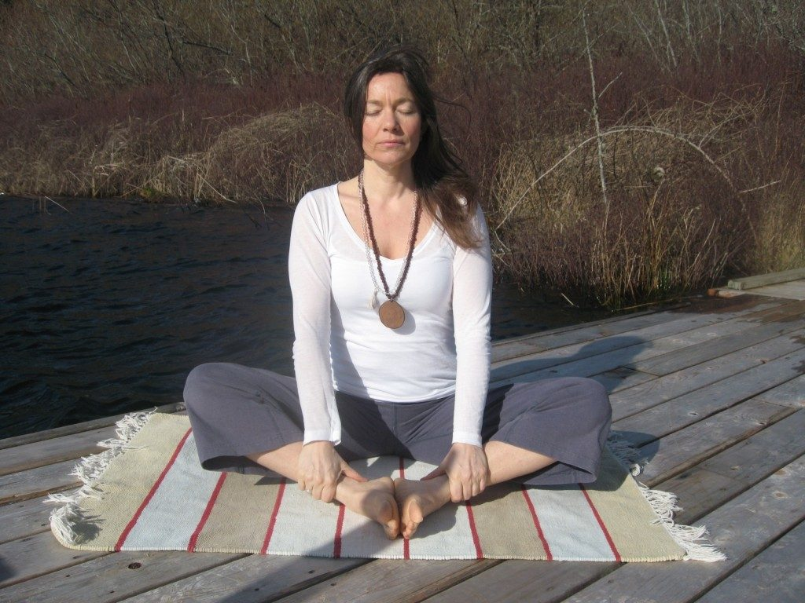
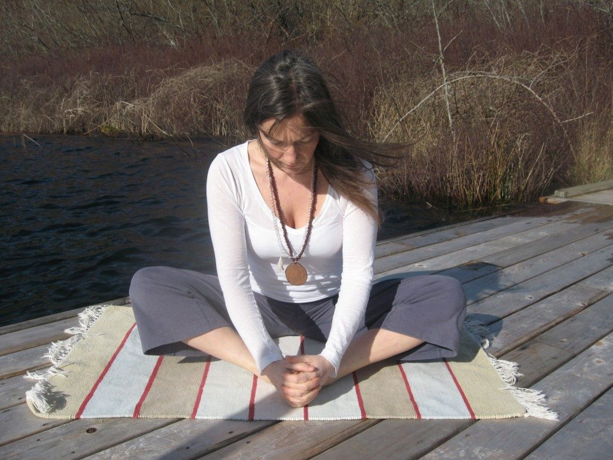

### Baddha Konasana (Bound Angle - Butterfly)

[caption id="attachment\_6544" align="alignnone" width="553"] Baddha Konasana[/caption]
I find myself in this posture in almost every practice as I love the deep hip opening and the gentle elongation and release in the lower back and sacrum. I share it regularly with my students, who are mostly women as it is a great posture for menstrual health and pain, preparation for child birth and for ovarian health as it increases circulation and brings vitality to the whole pelvic area. But Baddha Konasana has lots to offer men too - everyone benefits from opening the hips and releasing tension from the pelvis and this posture is also great for prostate health. It is also good for strengthening the lower back, inviting deep surrender into stillness and calming the mind. The variations with this posture make it very flexible in a practice on its own or as a counter posture and it in it’s reclining version (Supta Baddha Konnasana) it’s a favourite restorative posture of mine too.

#### Coming into the posture

Starting in Dandasana (stick pose) seated with legs straight out in front, if needed ensure that the hips are supported in a slight anterior tilt by placing a prop (foam block or blanket) just under the buttocks so that the pelvis is neutral and the spine can lengthen straight up through the crown.
Bend the knees and bring the soles of the feet together, resting them about 6-8 inches from the body and allow the knees to fall out to the sides.
Take a few deep breaths all the way down the spine to the root chakra. With each exhalation allow the hips to soften as the knees fall away. With each inhalation gently elongate up through the spine feeling subtle spaces between each vertebrae. Allow the shoulders blades to come down the back and gently lengthen the neck. The chin is parallel to the floor. Widen the chest but take care not the arch the back or open the front ribs keep the spine neutral.
[caption id="attachment\_6543" align="alignnone" width="553"] Baddha Konasana[/caption]
Once you have taken a few breaths and settled into the posture feeling the pelvis rooted and stable, take a deep inhalation start to come forward as you exhale all the time gently enlongating the spine out of the hips. You are bending forwards from the hips not the waist and visualising the navel coming towards the feet. The breath remains free and not restricted by the spine curving forwards, elongate to ensure the freedom of the breath. Move slowly and gently. Stay slow and mindful and don’t rush to get anywhere… there is no goal or destination!
Rest half way down and take some breaths and lengthen. Then slowly start to bow forward coming into your full expression. You are guiding the navel towards the feet not the head. Keep the breath flowing freely and continue to elongate. I personally feel that elongation constantly during a practice is integral. Not to overdo it but to gently and consistently bring space into the joints, opening and widening the body while slowly moving towards the posture.
Rest in your full expression of the posture and if it feels appropriate for your body at this point there is an invitation to let go into releasing the spine into a curve and the had point towards the feet. Feel the surrender and openness in the body and in the hips.
Keep the breath smooth and slow and when complete on an inhalation slowly release and come up to sitting. Gently support the knees to release out of the posture. Straighten and shake out the legs.

#### Modifications

If there is discomfort in the knees due to injury you can support them with blocks or bolsters so the hips are able to relax more.
If the hips are very inflexible sit on something higher to raise yourself right up to assist the hips soften with more support.

#### Variations

- Bring the feet further out away from the body so the shape inside the legs is more of a diamond which will change the stretch away from the adductors and more into the glutes and lower back.
- Try raising the feet onto a foam block to access a different opening in the hips.
- With the hands turn the feet so the soles face the sky. Take care if there are any twinges in the knees and if so leave the soles of the feet together to protect the knees.

As spring shares it’s promise with little signs around us in our environment and more regular glimpses of sunshine, we can use this posture to ground and root and create strong foundations from which to spring forth open up from our deepest essence ready to sow our seeds and create beautiful amazing things in our personal lives and communities.
*Namaste*
[caption id="attachment\_6542" align="alignright" width="200"] Clare Blanchflower[/caption]

#### About the instructor

Clare Blanchflower has been a practitioner of yoga since 1996, when she found herself drawn to the devotional practices and community at the Sivananda Ashram in London, UK. She is a grateful graduate of SSCY YTT and a regular member of the centre sangha. She is committed to truth, service and living with presence and joy. She shares a practice that brings deep body awareness, curiosity, quietening, connection, balance and invites access to the deep knowing wisdom body where healing and transformation can take place. Teaching is her greatest place of learning.
