This month’s [Founding Member Feature](https://saltspringcentre.com/tag/founding-member-feature/) is not a founding member, but is by the daughter of two longtime students of Babaji and former residents at the Centre - and the only child born on the land (at least while it’s been a yoga centre) - Mamata Kreisler, daughter of [Rajani](https://saltspringcentre.com/2013/01/founding-member-feature-rajani-rock/) and Rajesh. Read it and learn what it was like for her to grow up in a yoga community - definitely worth reading.

### Growing up at the Centre

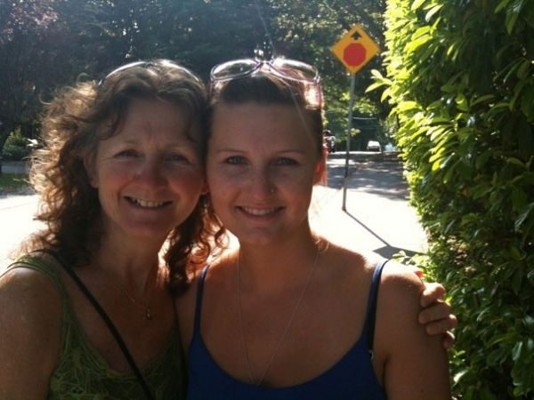 Mamata and her mother Rajani
I was born at the Centre in 1985 - in the cabin that later became the Phoenix Cabin - and I grew up there. It was my home for 12 years. It was a great place to grow up. 70 acres as your backyard, other families living just minutes away and fun trails to lakes and creeks never left a dull moment. I have so many memories of being a kid at the Centre:
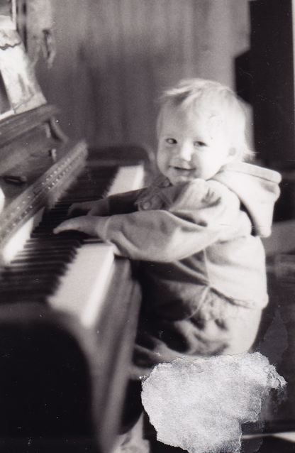 At the piano, 1986
Most mornings when I was really little, I would wake up in the cabin alone and have to walk up to the main building to see my mom, who managed the kitchen and was always up early getting breakfast ready - or go to Sharada’s to bang on her piano. Having sleepovers with Sammy and Leala (Satya’s daughters) in their teepee down by the woodland trail was a great memory, and walking through the orchard to see my dad at the nursery was a daily occurrence. I remember riding my bike down the mound - when it really was a mound - with Leala, each of us sticking one leg out and thinking we were so cool. I liked the mound like that. Many of you won’t even know what I’m talking about, but what we call the mound now is nothing like it used to be. It really used to be a mound, that is, a big hill. That’s before the rock walls were built and the top was made flat.
I got to do lots of things that other kids would never have had the chance to do. My dad taught me to drive the ride-on mower when I was four years old and I used to mow the grass all over the land. I remember getting into trouble when I let other kids ride on it with me when I was mowing.
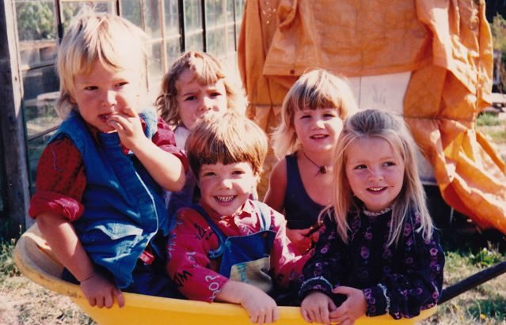 Wheelbarrow full of kids, 1989 Joah, Chrisana, Mason, Mamata, Soma
Some other special memories are of Leala and I sneaking into the walk-in cooler - with the lights off - to scare ourselves, which is ridiculous because I’m afraid of the dark. Another daring escapade was when Lisa (Chandrika and Harvey’s daughter) and I snuck into the staff kitchen during the summer retreats to make mint tea with Inka (now called Krakus); we thought we were cool because we were sneaking around.
My other “jobs” at the centre always included helping. Sharada used to joke that one day I’d run the Centre because I liked to walk around with a clipboard. I liked to organize things (still do) so people could actually find them when they needed them. My mom taught me how to do facials for Women’s Weekends, so I could help when there weren’t enough therapists. I also helped her build the swedan box, and I remember the building of Chikitsa Shala.
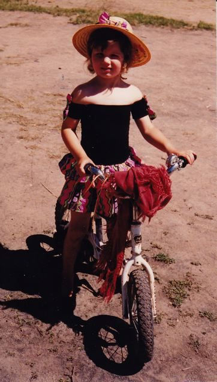 On her bike, 1990
I remember the mama cat who showed up one day and had kittens in the top shop. Asia (Bhavani Chlopan’s daughter), who was around two years old at the time, named the mama cat Dipsum, and I named all the others. We gave most of them away at the Saturday market in town, but we kept Dusty and Smokey. Lots of you may remember Smokey because she lived in the main house. Dipsum and Dusty eventually moved in with Sharada.
It’s almost Shiva Ratri time at the Centre again. Shiva Ratri was one of the kids’ favourite times. Sammy, Leala and I, along with Mason (Cynthia and Peter Bennett’s son) and Joah (Ramanand and Bhavani Chlopan’s son) - and later Jesse and Ayla (Savita’s daughters) - got to have a big sleepover in the yurt. The adults were staying up all night, so we stayed up, too. I remember it snowing on Shiva Ratri and going outside during the night to dance around and make snow angels.
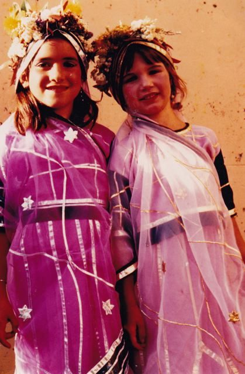 Leala and Mamata, temple dancers in the 1991 Ramayana
Another thing we all loved was Ramayana. I started out at age 5 as a temple dancer in the invocation to Saraswati, the first scene at the beginning of the play. I played other roles over the years, dancing and acting. We all looked forward to getting bigger parts each year.
I went to the Centre School from grades one through nine. We did lots of theatre in school as well, ones we wrote, lots of Shakespeare and lots of musicals. I got to play Maria in the Sound of Music and Wendy in Peter Pan.
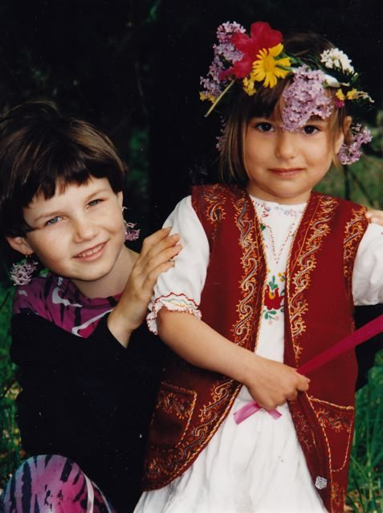 Mamata and Asia, May Day at the school, 1995
My mom was the school bus driver (yes, we used to have a school bus), and I’d go on bus runs with her. Our bus only went down Cusheon Lake Road and Beddis Road. For the south end route, though, you’d have to connect with the public school bus to go further. I did that once in awhile when I was going to the south end to my dads. I sat next to a kid who asked me, “Why do you go to that school?” I think he thought it was weird, but that had never occurred to me. It wasn’t weird; it was fun. Apart from the regular school stuff and theatre, I played a lot of sports. I was a tomboy and played mostly with the boys.
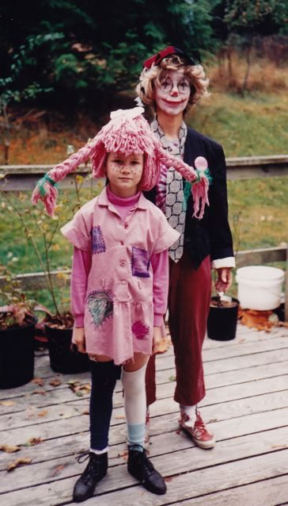 Mamata as Pippi Longstocking and Sharada as a clown, Halloween 1993
In 1993, when I was 8 years old and in Usha’s class, someone came to the classroom to get me, saying something had happened and I was to come right away. They took us to the cabin - the one my mom and I had been living in, the one I was born in. There had been a fire. My mom was already there, and so were the firefighters from the Fire Department. There was a strong smell of smoke. Even now, the smell of smoke reminds me of that moment. After that, we lived in the main building until a new cabin was built for us.
Summer retreat at the Centre was so much fun! When I was really little I was scared of getting candy from Babaji, but it got easier as I got older. The kids were always excited for tea time when Babaji would give out candies. You’d get to hang out with Babaji and obviously (in our world) we felt cool when we got to sit next to him. The other thing about retreat time that made it so much fun was that all our cool, older guy friends (Toby, Jai, Susheel, Jesse, PK, Yogi, AJ, etc.) came and did Power of Pranayama demonstrations, and hung out with us. We played Capture the Flag every night. (AJ, if you’re reading this, I hope you are sufficiently honoured to be included in this group of cool guys). Volleyball was always a must and basketball tournaments became a regular occurrence for awhile. I thought for sure I was going to be trampled on multiple occasions during those tournaments but somehow, I made it out of them alive.
[Hanuman Olympics](https://saltspringcentre.com/2010/06/hanuman-is-back/) was the highlight of the retreat. It was held in the front field (before the garden went in there). The big tent would be set up for the event. There were so many events - real events that everybody competed in. So much fun! In the evening there’d be a big talent show. My friends and I always did dances.
My memories of growing up at the Centre mostly have to do with having fun. I didn’t really take advantage of the learning possibilities, as I didn’t realize the “outside world” wasn’t the same and not all people grew up that way.
After we moved off the land, I went to high school, got into dance, and began to learn about the “real world.” I was planning to go to university to study dance, and then I got into a car accident. That was on October 1, 2003. My ability to continue what I thought my journey was going to be changed completely. I was unable to do anything I had put my mind to for the past few years, and my excitement for the future slowly vanished. I couldn’t picture what I was going to end up being able to do.
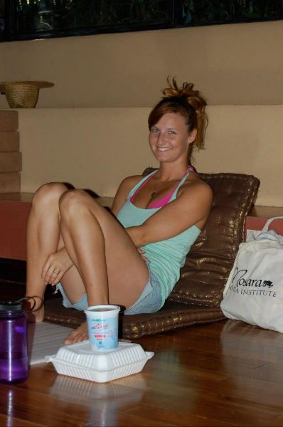
I stayed on Salt Spring Island for another year and a bit, did physiotherapy and other treatments, but nothing seemed to work. I moved to Victoria, enrolled in a business administration program and got a government office job. That was it for a while. Then my friend started talking about yoga, asking all sorts of questions about how I grew up and wanting to know more about what asanas can do for you. So I agreed to take him to a yoga class at Yoga Shala, and slowly but surely I started to realize how much I enjoyed asana, and how much I could simply focus on my body instead of everything around me. I started going more and more often. It was hard at first because I found myself comparing my current flexibility and strength to how I was before the accident, but that changed over time. When I got a roommate to start practicing with me, I quickly noticed how much her attitude started to shift, becoming more positive. This gave me a huge push toward wanting more yoga in my life - and the possibility of sharing that positive lifestyle with others.
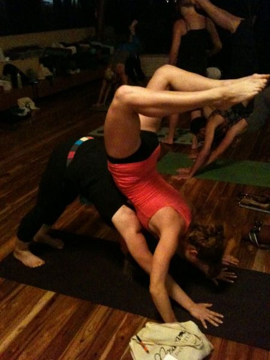
In 2011 I decided to do Yoga Teacher Training. I was so excited - until I got to the airport, at which point I sort of freaked out. I had never done anything on my own before. I was going to a place in Costa Rica where I knew no one, and I don’t speak Spanish very well. It turned out to be the best time of my life - a huge shift for me. I opened up and allowed myself to really let go and to get in touch with my emotions and explore how I really felt about things. I actually made myself - with the help of my two wonderful roommates - spend time alone to see what it was really like. This, of course, didn’t happen too much as I quickly got to know the group I was surrounded by and loved every one of them. I got to share it with people I hadn’t known before, and with whom I’m still in contact. As the month came closer to the end, all I was missing was my boyfriend, Kris, and would tell him, when there was finally internet service so we could connect by skype, to fly down and bring my bed.
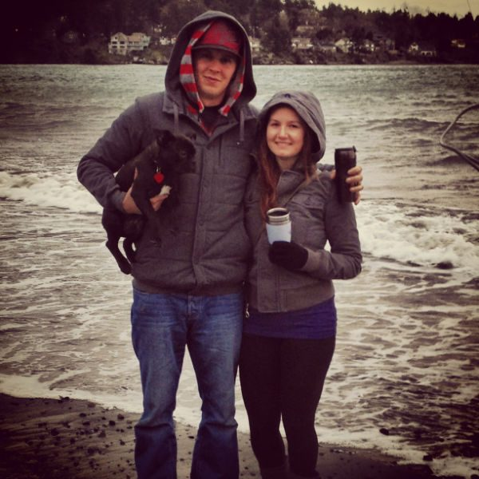 With Kris and their dog Biggie
Kris and I have been friends for six years, but we haven’t been together that long. Last May we went to California and I took him to Santa Cruz. On our last day there we went to Mount Madonna Center and were lucky enough to see Babaji, again. I had seen him the previous year, and he still remembered me.
Sammy, Leala and I still talk about Babaji, and wonder what will happen when he passes away. I can’t imagine him not being here. For me and for all of us kids, I think this has been the best way to grow up.
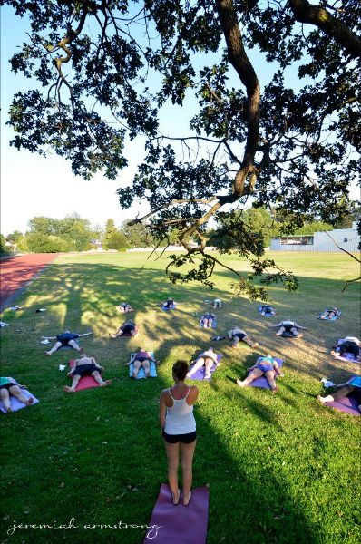 Teaching
Currently I’m still living in Victoria, in a cute little house we bought last year, and now we have a dog, Biggie. I don’t think we will stay here, but where we will go hasn’t been decided - somewhere smaller, more community based. I’m teaching three yoga classes a week in Victoria in addition to working full time for the government. Yoga alleviates the stress of my government job, and teaching yoga doesn’t feel like work. I like to help people, to support them in accepting themselves as they are, with whatever they can do. It’s a joy to be able to share yoga with those who are open to receiving it.
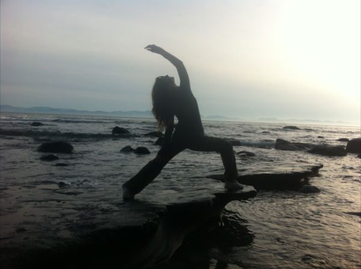
