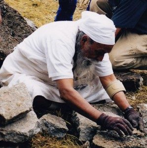

[caption id="attachment\_6540" align="alignright" width="298"] Babaji working on a rock wall project, 2000[/caption]
The Salt Spring Centre of Yoga is rooted in the practice of karma yoga, the practice of selfless service, or at least holding the intention of the practice of selfless service. Until we’re no longer identified with our own individual stories - our bodies, our thoughts, our relationships and our ‘things’ - we are not fully practicing selflessness. Yet if our intention is to be of service, we’ve begun the practice.
In his essay *Selfless Service, the Spirit of Karma Yoga* Babaji writes:

*In Karma Yoga you are engaged in actions all the time. Actions to maintain your body, to support your family, to help the society and your country, all come under Karma Yoga. One may ask, “How is the practitioner of Karma Yoga different, since everyone in the world does all these activities?” The difference is that a karma yogi has a different intention and aim than the ordinary person. The karma yogi works with the intention of doing selfless service, maintaining awareness that the ultimate aim is liberation. Moreover those who work with the spirit of Karma Yoga feel no action is a burden because all actions are simply a duty.*

*Although Karma Yoga is usually understood to be merely a path of action, it is truly a path of inner development.*

Babaji has taught us through his writings and formal teachings, and very largely by example. He works at whatever needs doing, he gives freely of his time, he engages with every person who approaches him, he listens with compassion and he jokes and plays with children and adults alike. Whatever he does is for the benefit of others. That is the classical teaching of Karma Yoga.
Babaji’s teachings are direct and practical:

*Any work which does not directly fulfill your ego is Karma Yoga. If someone’s tire is punctured and you stop to help, that is spiritual work. If you remove a nail from the road because you think someone my step on it, that is Karma Yoga. Anything done with good intention is Karma Yoga.*

In sorting through some archives recently, I came across a copy of Offerings from 1994 (printed version, long before we had a website) which contains writings on karma yoga from *The Teaching of Buddha**,* published in 1984 by Bukkyo Dendo Kyokal, a Buddhist teacher from Japan, and selected for Offerings by Ma Renu, the woman who first sponsored Babaji to come to North America in 1971. Following is an excerpt from these writings:

*There are seven kinds of offering which can be practised even by those who are not wealthy. The first is the physical offering. This is to offer by one’s labour. The second is the spiritual offering. This is to offer a compassionate heart to others. The third is the offering of the eyes. This is to offer a warm glance to others which will give them tranquility. The fourth is the offering of countenance. This is to offer a soft countenance with a smile to others. The fifth is the oral offering. This is to offer kind, warm words to others. The sixth is the seat offering. This is to offer one’s seat to others. The seventh is the offering of shelter. This is to let others spend the night at one’s home. These kinds of offerings can be practiced by anyone in everyday life.*

Very practical advice, much like Babaji’s. We can all practice karma yoga, whatever our life situation.
From Babaji:

*To serve others with no selfish motive is sacrifice. To give what others need with no strings attached is charity. To live a disciplined life is austerity. Sacrifice, charity and austerity together in action is called Karma Yoga.*

--
Contributed by Sharada
