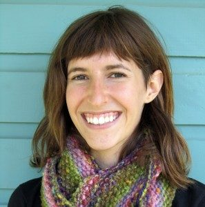

 YTT 2012 Graduate, Jessica Encell
Hello!
My name is Jessica and I am a 22 year old graduate of the Summer 2012 YTT at the amazing Salt Spring Centre of Yoga.
**Where do you live? What do you do in your life apart from yoga?**
I live in Santa Monica, CA. I graduated from college (university) in September where I was studying Sustainability and Environmental Awareness. I am currently teaching one yoga class a week (thank you SSCY!), working with the nonprofit 5 Gyres to educate people on marine plastic pollution and playing as a nanny for two beautiful 8 year old identical twin girls.
**What attracted you to the SSCY YTT program?**
This experience seemed to magically sneak into in my life. It was a wonderful synchronicity that I happened to be visiting my grandparents on the island at the beginning of summer. I was planning to work as a children’s surf instructor in Los Angeles.... until.... My amazing grandmother Phyllis Coleman took me to see the centre and introduced me to Shankar. We walked through the property - which at the time was covered in caterpillars- and as he told me about the program that was beginning in a few weeks I had an inkling that I might not work as a surf instructor after all. I left the centre feeling totally enchanted: the land was magnificent, Shankar was wise, welcoming and humorous, and there was a quote in gold letters from Babaji that really grabbed me, “Dream is real as long as you are asleep. Life is real as long as you are not awakened.”
A few days later I signed up for the program!
**What aspect of yoga has had the most transformative effect on your life?**
The most transformative aspect of yoga has been the continual changes in perspective and mindset that it manages to bring about. It is relentlessly teaching me to shift states from scattered to aware, rushed to present, reactive to responsive, and is constantly filling me with a sense of gratitude and joy for life.
**What surprised you the most about the practice of yoga? How has your understanding of yoga deepened?**
Joseph Campbell said, “The cave you fear to enter holds the treasure you seek.” And so it was in the program, where the most challenging aspects, the ones that brought up the most internal resistance, were the most rewarding. For me these were: A consistent and lengthy pranayama practice and the teaching components at the end of the program. It turns out these were the gifts that kept on giving!
Now I have taken these things and integrated them into my daily life. I came to the program with little understanding of the non-physical aspects of yoga but left being most positively impacted by the philosophies and mental tools. It is largely a process of making friends with the mind - whether it does not want to sit still and cultivate focus in pranayama or whether it fears inadequacy and offers self imposed judgment before teaching a portion of a class - the mind is always presenting challenges and the program provided a wealth of tools to meet these challenges with awareness, positivity and a smile. I’ve realized how beneficial a consistent practice is.
**Please share some memorable moments from YTT. A favourite memory?**
Great conversations and lots of laughs. Before the program began, I wondered if the atmosphere would be somber and serious. Instead, large amounts of joy, laughter, humor and positivity filled my experience.
A few more highlights...

- Lying in the meadow at night snuggled up with Kandace, Katie and Shaun watching the meteor shower.
- The surreal feeling of being in a family and community with a group of people that you have only just met.
- Walking barefoot through the tall soft grasses of the beautiful field before jumping naked - optional :) - into Blackburn Lake.
- Chetna’s shelf yoga class.
- Challenging and rewarding daily pranayama and meditation with Divakar
- Delicious farm fresh meals prepared with so much love (thank you KYs!)
- Living in the presence of people who are older and have only grown wiser and more vibrant with age. A lot of the elders I have encountered throughout my life seem to have grown stuck and tired with age. At the centre it really struck me how, rather than hardening with time, everyone had blossomed.
- The amazing and inspiring collection of beautiful wise women - Kalpana, Chandra Rose, Sharada, C.P., Julie, Chandra, Chetna, Kishori, Sarah, Shilpa, Sam - I’m talking to you!

**What can students expect from the yoga teacher training at the Centre?**They can expect to have an amazing and transformative experience with compassionate, knowledgeable and down to earth teachers.
I have so much love and gratitude for each and every person in the program who made the experience exactly what it was.
Thank you
Jai!

### For information about the Salt Spring Centre of Yoga’s YTT program, visit:

[Yoga Teacher Training home](https://saltspringcentre.com/programs-retreats/trainings/yoga-teacher-training/)
