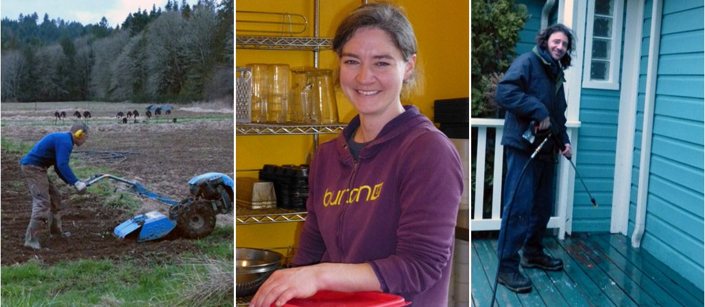
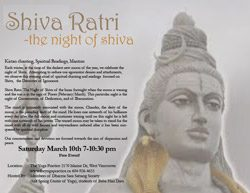
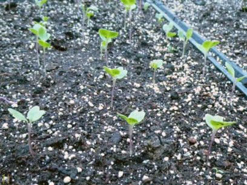

Welcome to spring at the Centre - a typical west coast spring: weather a little warmer, green and wet, some spring bulbs popping up, and above all, longer hours of daylight. Time to wake up!
[caption id="attachment\_6593" align="alignnone" width="617"] Jack, Tanya and Stacey preparing the centre for a new season[/caption]
Our program season begins this month with a [Yoga Getaway](https://saltspringcentre.com/retreats-programs/yogagetaways/), March 22-24, by which time our karma yogis for the first term of [Karma Yoga Service and Study](https://saltspringcentre.com/karma-yoga-service/) (KYSS) will have arrived. We are ready for them! On March 1, several full-season yogis arrive. They will be welcomed with a Bhakti evening: arati, a puja, kirtan and the chanting of the healing mantra, led by Shantam, whom we’ve had the good fortune to add to our community for the past month. During his time here, he has developed a registration software program for us, not to mention singing and drumming at satsang and leading rituals such as the full moon puja we recently celebrated. It’s been a delight to have him here. However, work - and above all, Stephanie - are calling him back to [Mount Madonna](http://www.mountmadonna.org).
Shiva Ratri is right around the corner. On March 10, into the early morning of March 11, there will be prayers, mantra and kirtan all night, the night of Shiva. Follow [this link](https://saltspringcentre.com/2013/01/shiva-ratri-2013/) for details. Because Shiva Ratri falls on a Sunday this year, satsang that day will be cancelled. Come for the evening - or the whole night if you like, for chanting and prayer. For those in the Vancouver area, if you’d like to participate in Shiva Ratri, you can come here and sing all night or you can go to the shorter version, 7 - 10:30 pm, celebrated by the Vancouver satsang. It will be held at ‘The Yoga Practice’, 2170 Marine Drive; West Vancouver. Details are on the poster which you can [download here](https://saltspringcentre.com/wp-content/uploads/2013/02/Shiva-Ratri-2013.pdf).
[caption id="attachment\_6596" align="alignright" width="326"] The winners, Beira kale[/caption]
The big news from the farm is that the greenhouses are planted, and Jack reports that the winner of this year’s first-sprout competition is Beira Kale. Let’s hear it for the little seedlings! The farm yogi team will be arriving mid-March, and there is plenty for them to do. In other farm news, the farm now has a truck, perfect for taking produce to the Saturday market and for on-land chores. Thanks to Stacey, Jack and SN for arranging the purchase.
There are a number of articles I’d like to draw your attention to. This month’s [Founding Member Feature](https://saltspringcentre.com/tag/founding-member-feature/) is not a founding member, but is by the daughter of two longtime students of Babaji and former residents at the Centre - and the only child born on the land (at least while it’s been a yoga centre) - [Mamata Kreisler](https://saltspringcentre.com/2013/02/founding-member-feature-mamata-kreisler/), daughter of [Rajani](https://saltspringcentre.com/2013/01/founding-member-feature-rajani-rock/) and Rajesh. Read it and learn what it was like for her to grow up in a yoga community - definitely worth reading.
This month’s [Meet our YTT Grads](https://saltspringcentre.com/tag/ytt-grad/) features [Jessica Encell](https://saltspringcentre.com/2013/02/meet-our-ytt-grads-jessica-encell/), one of last year’s [Yoga Teacher Training](https://saltspringcentre.com/yoga-teacher-training/) grads, who also happens to have a longstanding connection with this community, although none of us (including Jessica) knew it until last summer. Jessica was visiting her grandmother, who was instrumental in in the purchase of this land. We all have our own routes to the Centre - and to our own centre.
The [Asana of the Month](https://saltspringcentre.com/tag/asana-of-the-month/) is [Baddha Konasana (Bound Angle, aka Butterfly)](https://saltspringcentre.com/2013/02/asana-of-the-month-baddha-konasana/), presented by Clare Blanchflower, a YTT grad and one of the teachers at the Centre’s Yoga Getaways. Many of you will have had the pleasure of experiencing her classes, and the warmth and caring of her teaching style. Her instructions are both clear and inviting.
March is a short month at the [Centre School](https://saltspringcentre.com/about/centre-school), since spring break takes up half of it. Before the break, though, there are report cards and student-led conferences. Often when kids come home from school, their parents ask them what they did that day, but the kids have already moved on to what’s happening right now. (We have so much to learn from children!) During student-led conferences, parents actually get to see and experience some of the things their kids have been learning, and the kids get to be the guides and teachers.
In this newsletter there is an [article about karma yoga](https://saltspringcentre.com/2013/02/karma-yoga/) that I invite you to read. To whet your appetite, here is a song written a by [Sanatan](https://saltspringcentre.com/2012/04/founding-member-feature-sanatan/) a number of years ago, when the ‘mountain-fountain’ was being built during a summer retreat. Here are the lyrics. Perhaps you can persuade him to sing it for you one day.

*Salt Spring Centre has been built by hand*
 *By the magic and the mortar of the karma yoga man,*
 *The magic and the mortar of the karma yoga woman.*

*Yes, that long rock wall has been built by hand*
 *From the magic and the mortar of the karma yoga man,*
 *The magic and the mortar of the karma yoga woman.*

*Listen to me, children, here’s a riddle and a rhyme*
 *About a man who built a mountain that the angels could climb.*
 *He built it with the skill and the magic that he learned*
 *When he found that holy river and those old samskaras burned,*
 *When he found that holy river and those old samskaras burned.*

*Karma yoga woman, karma yoga man,*
 *We’ll care for you and feed you the best we can.*
 *We want you to come here and have a good time*
 *And know that karma yoga gives you peace of mind.*
 *Karma yoga gives you peace of mind.*

*Well, this mountain and this fountain have been built by hand*
 *By the magic and the mortar of the karma yoga man,*
 *The magic and the mortar of the karma yoga woman.*

*Listen to me, children, here’s a word from the wise,*
 *I got it from the man with the sparkling eyes.*
 *Take it with a chuckle or a grain of salt -*
 *If your foundation buckles, then it’s all your own fault.*
 *If your foundation buckles, then it’s all your own fault.*

*Salt Spring Centre has been built by hand*
 *By the magic and the mortar of the karma yoga man,*
 *The magic and the mortar of the karma yoga woman.*

Thank you all for the magic you bring.
In peace,
Sharada
