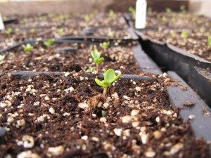
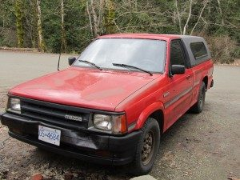

Many of you may have noticed the signs of the new season: daffodils peeking out of the ground; nettles emerging from their prickly slumber; or, here at the Salt Spring Centre of Yoga, the humming sounds of our tiller -- affectionately known to us as Matilda -- busily preparing the soil for the many crops to come. Indeed, if you come visit us, you'll see lots of changes on the farm, from fields being de-mulched, to beds being remade, and, of course, to the greenhouses filled with little seedlings. This year, we're not only growing the tried and true crops of salad, broccoli, cauliflower, kale, tomatoes, eggplant (and so much more!), but also some new experiments like Florence Fennel (the bulbing variety), celery, and yard-long beans.
[caption id="attachment\_6664" align="alignright" width="300"] Little seedlings saying hello[/caption]
Having had a great season last year growing for the Centre kitchen as well as for the community through our farm stand, we're excited to expand both. We're planning on offering much more variety on our farm stand, including bunching onions, cilantro, garlic and eggplant. Keep checking the Salt Spring Centre website for recipes and ideas on how to prepare our produce as well!
In about a month, we'll be stocking our farm stand again, so be prepared for the first crops of the season: spinach, salad mix, arugula, radishes and hakurei turnips. We will again be sending out a notice on Thursday about the availabilities for Saturday, so you'll be able make orders ahead of time and find your produce waiting for you in the cooler.
One more thing! And this is important because we need your help. We recently had an addition to the farm team: a brand new (old) truck! We're very happy to have a great working truck to take us to and from market, but... we don't have a name for it yet.
[caption id="attachment\_6663" align="alignleft" width="300"] New (old) truck in need of a name![/caption]
Please help us name our truck! The person who comes up with the best name will be sent a variety of saved seeds (3 kinds of lettuce, cabbage, rutabega, and chard) from the Centre, as well as the Centre cook book, "The Salt Spring Experience". You can suggest a name very easily by commenting on the post on our post on our  [Facebook](https://www.facebook.com/saltspringcentreofyoga?ref=hl) page. Let's find a name for Matilda the Tiller's new friend!
Much much more soon as we enter into the new season!
