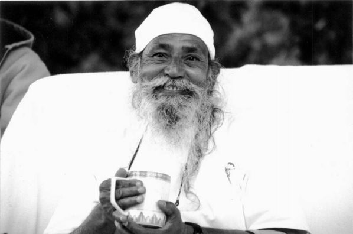

**The Hanuman Fellowship invites you to join with us in honoring**
 **Babaji’s life and works in his 90th year
 during**

### The Upasana Retreat at
 Mount Madonna Center May 23 – 27th, 2013


In the spirit of “reunion”, we are celebrating Babaji’s 90th birthday and the many projects he has inspired in the US, Canada and India. Please join us in acknowledging the great gift of his presence and guidance in our lives and all we have created together. If you have early photos or videos of Babaji and his students,
 contact: sudhirdass@mountmadonna.org
.

*Please note that Babaji’s presence during the retreat 
will wholly depend upon his health and energy each day.*

**Canadian friends, if you are interested in attending this event, please contact [Sharada](mailto:sharada@saltspringcentre.com) or [Lakshmi](mailto:lakshmi@saltspringcentre.com).**
